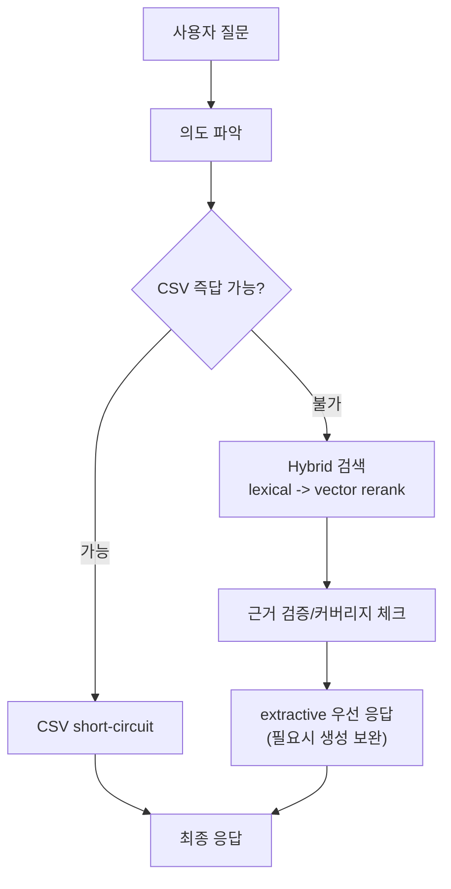

# 아키텍처 + 워크플로우 빠른 파악 (팀 공유용)

## 0) 문서 목적
- 팀원이 처음 봐도 5~10분 안에 "왜 이런 구조인지"까지 이해하게 만드는 요약 문서
- 핵심은 **속도(지연) + 정확도(근거성) + 운영 안정성**의 균형

## 1) 한눈에 보는 전체 흐름

## 2) 왜 이 아키텍처를 선택했나

1. CSV 우선 경로를 둔 이유
- 사업비/공고번호/마감일 같은 구조화 질문은 DB 검색보다 CSV direct lookup이 빠르고 안정적임
- 불필요한 벡터 검색을 줄여 평균 지연 시간을 낮춤
- 단, 복합/비교 질문에는 오답 위험이 커서 CSV 즉답을 제한

2. Hybrid(렉시컬 -> 벡터) 검색을 쓴 이유
- 렉시컬 1차 필터: 키워드 정확도가 높은 질의(요구사항 코드, 단위, 규격)에서 정밀도 확보
- 벡터 재정렬: 표현이 다른 동의 문장까지 회수해 재현율 보완
- 둘을 결합하면 "속도+정확도"를 동시에 챙기기 좋음

3. extractive 우선 응답 정책 이유
- 문서 근거를 직접 인용/요약하면 환각 가능성이 낮아짐
- 생성형 답변은 근거가 충분할 때만 보조적으로 사용해야 안정적임

4. 비교 질의 안전장치를 넣은 이유
- A/B 비교는 한쪽 문서만 찾고도 답을 생성하면 왜곡 가능성이 큼
- 그래서 최소 커버리지 미달 시 "근거 부족"을 명시해 오답을 방지

## 3) 시작부터 끝까지 런타임 로직

1. 앱 시작/초기화
- 파서, 검색기, 임베딩, 인덱스를 준비
- 이유: 런타임마다 무거운 초기화를 반복하면 첫 질의가 느려짐

2. 질문 수신 후 의도 분류
- 질문을 사실형/비교형/복합형으로 분류
- 이유: 질의 유형에 따라 최적 검색 전략이 다르기 때문

3. CSV short-circuit 판단
- 엄격 조건(구조화 필드 직접 질의)일 때만 즉답
- 이유: 빠른 대신 정확도 하락 위험이 있는 케이스를 차단

4. DB 검색(Hybrid)
- lexical로 후보 축소 -> vector로 의미 재정렬 -> 필요 시 fallback
- 이유: 전체 코퍼스를 매번 벡터 탐색하는 비용을 줄이면서 정답 후보 품질 유지

5. 근거 검증 후 답안 구성
- 숫자/단위/기한/문자셋은 관련 앵커 라인 우선 추출
- 비교 질의는 양측 근거 유무를 먼저 점검
- 이유: 실제 오답 패턴(무관 숫자 선택, 한쪽 문서 누락)을 직접 줄이는 방식

## 4) 입력 전처리 선택 근거 (최종 표현은 MD 통합)

1. 공통 원칙
- 최종적으로는 CSV/PDF/HWP를 **모두 Markdown 표현으로 통합**해 같은 검색 파이프라인으로 보냄
- 이유: 청킹/인덱싱/검색 로직을 하나로 유지해 운영 복잡도를 낮추기 위해

1. CSV를 별도 취급하는 이유
- CSV는 이미 구조화되어 있어 본문 파싱 없이 바로 필드 단위 활용 가능
- 그래서 `fast-path`(사업비/공고번호/마감일 등)에서 가장 빠른 응답 경로로 사용

1. PDF/HWP를 따로 전처리하는 이유
- 최종은 MD라도, 변환 이전에 포맷별 파싱 난이도가 다름
- PDF는 표/본문 동시 추출 품질이 중요하고, HWP는 변환 실패 대응(fallback) 유무가 품질을 좌우함
- 즉 차이는 "최종 포맷"이 아니라 "MD로 오기 전 추출 안정성 확보 방식"에 있음

## 5) 현재 정책의 트레이드오프

1. 장점
- 평균 레이턴시 절감
- 사실형 질문 정밀도 개선
- 비교 질문의 환각 리스크 감소

2. 단점
- CSV strict rule 때문에 즉답 가능한 질문 일부를 DB로 넘길 수 있음
- lexical 비중이 높으면 표현이 다른 질의에서 초기 후보 누락 가능

3. 보완 방향
- 질의 타입별로 lexical 가중치 적응형 튜닝
- 저점 문항 회귀 테스트를 상시 자동화

## 6) 참고 코드 위치 
- 메인 흐름: `src/graph/workflow.py`
- 하이브리드 검색: `src/retrievers/vectorstore.py`
- 의도/프롬프트: `src/graph/nodes.py`, `src/prompts/templates.py`
- 문서 파서: `src/parsers/csv_loader.py`, `src/parsers/pdf_loader.py`, `src/parsers/hwp_loader.py`
