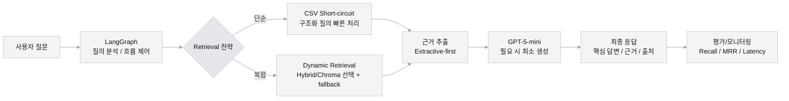

# 입찰메이트 RFP 챗봇

Streamlit UI + Chroma 기반 RAG 파이프라인입니다.

- UI: `app/main.py`
- 워크플로우: `src/graph/workflow.py`
- 벡터 DB: `data_index/chroma_B`
- 평가 스크립트: `scripts/eval_retrieval.py`, `scripts/build_eval_report.py`

## 1) 재현성 전제 (중요)

원격 저장소에는 대용량 데이터/DB가 포함되지 않습니다.  
다른 로컬에서 **같은 성능**을 재현하려면 아래가 동일해야 합니다.

1. `data_index/chroma_B` (동일 Chroma DB 세트)
2. `data/data_list.csv` (워크플로우 CSV 메타 참조)
3. `data_index/data/data_list.csv` (앱 CSV 직접응답 경로)
4. `.env`의 모델/키 설정
   - `OPENAI_API_KEY`
   - `EMBEDDING_MODEL=jhgan/ko-sroberta-multitask` (현재 운영 기준)

## 2) 설치 및 실행

```bash
git clone -b dev https://github.com/Loah-Lee/AI_7-team.git
cd AI_7-team

# one-shot
./scripts/bootstrap.sh

# 또는 수동
python3 -m venv .venv
source .venv/bin/activate
pip install --upgrade pip
pip install -r requirements.txt
cp .env.example .env
```

`.env` 수정 후:

```bash
streamlit run app/main.py
```

## 3) 현재 런타임 동작 요약

- 앱은 `data_index/chroma_B`를 우선 DB 경로로 사용합니다.
- DB가 이미 있으면 자동 재적재를 건너뛰고 기존 Chroma 컬렉션을 재사용합니다.
- `top_k=10`으로 질의합니다.
- CSV short-circuit는 기본 활성화(`CSV_SHORTCIRCUIT_ENABLED=true`)입니다.
- 사이드카 자산 검색은 기본 비활성화(`RETRIEVER_ASSET_SIDECAR_ENABLED=false`)입니다.

### 3-1) 기본 로직 흐름 (그래프)



## 4) 최신 평가 실행 (권장)

```bash
# 20문항 평가 (chunk synced dataset)
python scripts/eval_retrieval.py \
  --label full20_chunk_synced_after_module_split_phase2_20260301 \
  --dataset eval_resources/eval_dataset_chunk_synced.yaml \
  --top_k 5

# HTML 리포트 생성
python scripts/build_eval_report.py \
  eval_resources/eval_results_full20_chunk_synced_after_module_split_phase2_20260301.json
```

생성 리포트:

- `eval_resources/eval_report_full20_chunk_synced_after_module_split_phase2_20260301.html`

## 5) 트러블슈팅

- `ModuleNotFoundError`: 가상환경 활성화 후 `pip install -r requirements.txt` 재실행
- CSV 직접응답 실패: `data_index/data/data_list.csv` 경로 확인
- DB 품질 급락: DB/CSV 세트가 기존 실험과 동일한지 먼저 확인
- 평가 점수 소폭 변동: LLM Judge 호출 특성상 재실행 변동이 일부 발생할 수 있음

## 6) 보고서
[AI_7team_발표PPT.pdf](https://github.com/user-attachments/files/25702519/AI_7team_.PPT.pdf)


## 7) 개인 협업일지
- 김경태 : https://www.notion.so/2fd8dd9ffeba80f59e03f68178656069?v=2fd8dd9ffeba80f0b023000ce1ea1652&source=copy_link
- 김재혁 : https://band-napkin-cd4.notion.site/2fdea78d0e418055a659ecd37a9ea3ea?v=2fdea78d0e4180299677000c7f758f65&source=copy_link
- 문진우 : https://www.notion.so/2fc033219c3280cfa110cbf97b98af10?source=copy_link
- 신유철 : https://www.notion.so/2fc9b7c8a21f80e6aa98e909df92660a?source=copy_link
- 이소윤 : https://www.notion.so/a6bfe536d3cf832783f0811f0276c5c0
