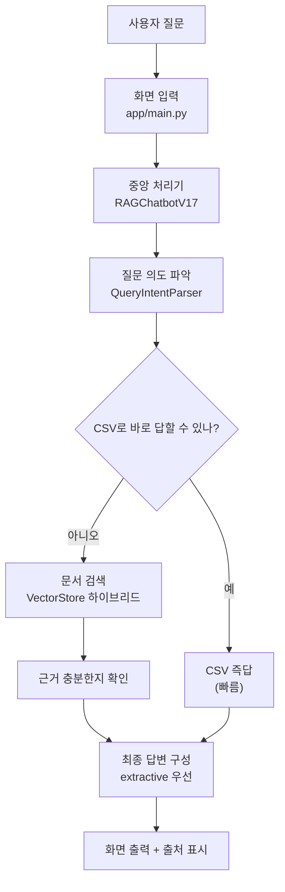
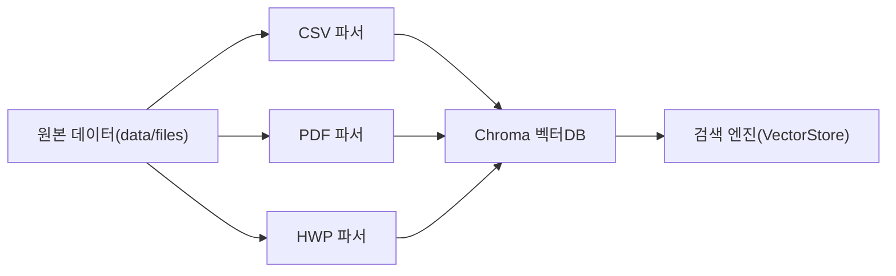

# 입찰메이트 아키텍처 (쉬운 버전)

## 한 줄 요약
- 이 서비스는 `질문 이해 -> 빠른 답 가능하면 즉답 -> 아니면 문서 검색 -> 근거 확인 -> 답변` 순서로 동작합니다.

## 질문 1개가 지나가는 길

## 내부 데이터 준비 흐름

## 단계별 설명 (비개발자용)
1. 질문 이해  
질문이 기관 조회인지, 비교인지, 숫자/기한 질의인지 먼저 분류합니다.

2. 빠른 길 확인  
`사업비`, `공고번호`처럼 CSV에 구조화된 값이 있으면 바로 답해서 속도를 확보합니다.

3. 문서 검색  
바로 답할 수 없으면 PDF/HWP/CSV를 함께 검색합니다.  
검색은 `렉시컬(키워드)`로 후보를 좁힌 뒤 `벡터(의미)`로 재정렬합니다.

4. 근거 검증  
근거가 부족한 비교 질문은 무리하게 생성하지 않고, 부족하다고 명시합니다.

5. 답변 생성  
가능하면 문서 문장을 그대로 활용하는 extractive 방식으로 답하고, 필요한 경우만 생성형을 보완합니다.

## 코드 위치 매핑 (어디를 보면 되는지)
| 기능 | 파일 |
|---|---|
| 화면 입력/출력 | `app/main.py` |
| 전체 흐름 제어 | `src/graph/workflow.py` |
| 질문 의도 파악 | `src/graph/nodes.py` |
| 상태/응답 타입 | `src/graph/state.py` |
| 검색/재정렬 | `src/retrievers/vectorstore.py` |
| 임베딩 | `src/retrievers/embeddings.py` |
| CSV/PDF/HWP 파싱 | `src/parsers/csv_loader.py`, `src/parsers/pdf_loader.py`, `src/parsers/hwp_loader.py` |
| 운영 설정값 | `src/utils/config.py` |
| 답변 프롬프트 | `src/prompts/templates.py` |

## 왜 이 구조를 썼는가
- 속도: 간단한 질문은 CSV 즉답으로 처리
- 정확도: 복잡한 질문은 하이브리드 검색 + 근거 검증
- 안정성: 비교/다문서 질문에서 근거 부족 시 환각 답변 방지
- 운영성: 설정값으로 품질 모드/검색 강도 조절 가능

## 발표용 사용 안내
- 기술 발표 스크립트: `docs/ARCHITECTURE_PRESENTATION.md`
- 이 문서는 "처음 보는 사람에게 3분 안에 설명"하는 용도로 사용
