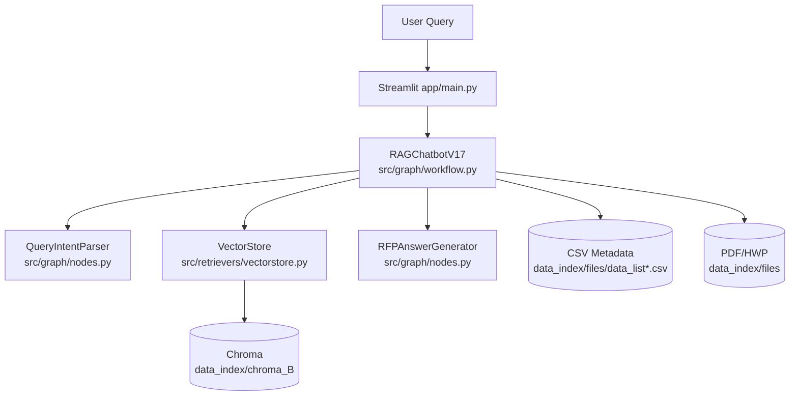

# ARCHITECTURE

## 런타임 구성

## 핵심 포인트

- `CSV short-circuit`:
질문이 사업비/공고번호/마감일 등 구조화 필드면 LLM 호출 없이 빠르게 응답
- `Org overview short-circuit`:
`~ 정보 알려줘` 유형은 기관 메타데이터로 즉시 응답
- `Fallback retrieval`:
org 필터로 결과 0건이면 필터 없는 재검색 후 그래프 단에서 재필터링
- `Follow-up memory`:
주어 생략 후속질문에 대해 이전 기관 문맥을 유지

## 데이터 경로

- 문서 원본: `workspace_collab/data_index/files`
- 기본 DB: `workspace_collab/data_index/chroma_B`

