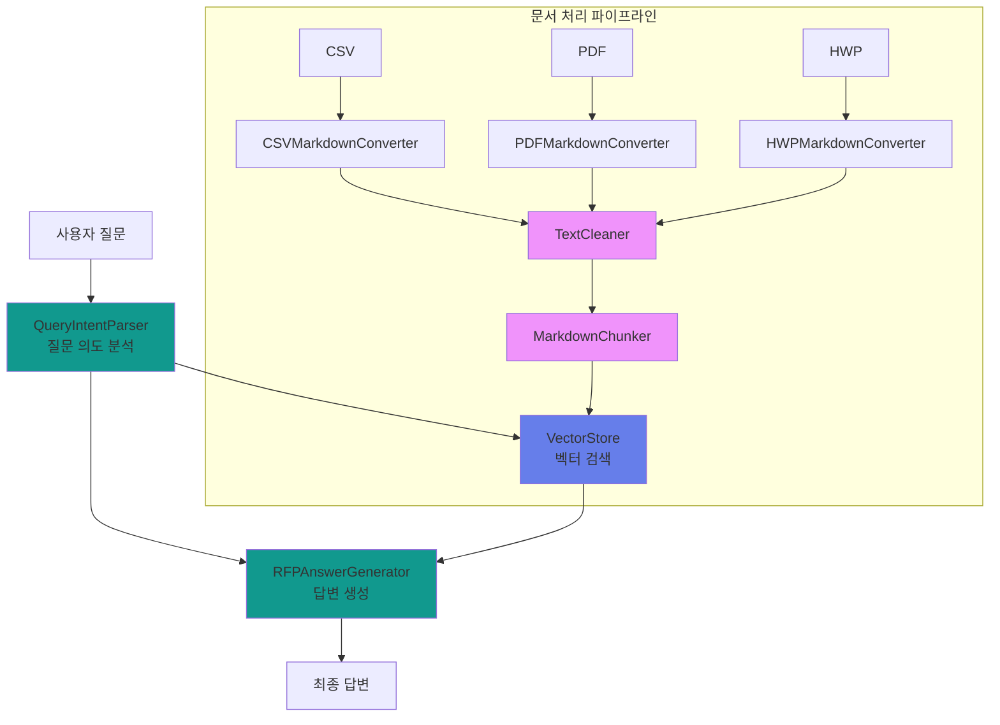
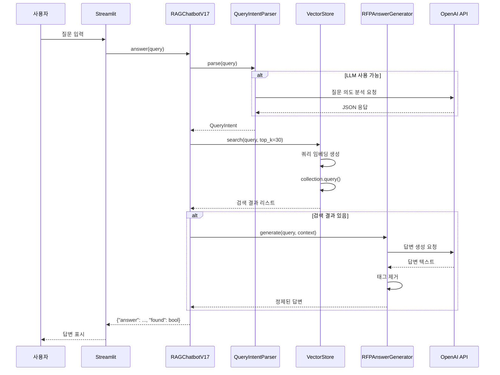
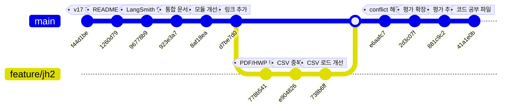

# 입찰메이트 RFP 챗봇 v17 - 코드 공부 가이드

> 이 문서는 프로젝트의 모든 코드를 분석하고, 각 함수가 왜 필요한지 설명합니다.

---

## 목차

1. [전체 아키텍처](#1-전체-아키텍처)
2. [그래프/워크플로우 모듈](#2-그래프워크플로우-모듈)
3. [파서 모듈](#3-파서-모듈)
4. [검색 모듈](#4-검색-모듈)
5. [프롬프트 템플릿](#5-프롬프트-템플릿)
6. [유틸리티 모듈](#6-유틸리티-모듈)
7. [웹 애플리케이션](#7-웹-애플리케이션)
8. [데이터 흐름 분석](#8-데이터-흐름-분석)

---

## 1. 전체 아키텍처

### 1.1 핵심 설계 철학



### 1.2 핵심 설계 결정

| 결정사항 | 선택 | 이유 |
|:---|:---|:---|
| **벡터 DB** | ChromaDB | 로컬에서 실행 가능, Python 네이티브, 빠른 검색 |
| **임베딩** | OpenAI text-embedding-3-small | 1536차원, 가성비 좋음, 한국어 잘 지원 |
| **LLM** | gpt-4o-mini | 빠르고 저렴짐, 질문 파싱에 충분 |
| **문서 형식** | 마크다운 | LLM이 이해하기 쉬고, 청킹이 용이 |
| **검색 방식** | Cosine Similarity | 텍스트 의미 기반 검색, 효과적 |

---

## 2. 그래프/워크플로우 모듈

### 2.1 state.py - 데이터 정의

**목적**: 시스템의 핵심 데이터 구조를 정의하고, 타입 안정성을 보장합니다.

#### OrgInfo (기관 정보)

```python
@dataclass
class OrgInfo:
    name: str              # 기관명 (핵심 식별자)
    amount: str = ""       # 사업비 문자열 (사용자 표시용)
    amount_numeric: float = 0  # 사업비 수치 (정렬/필터링용)
    project_name: str = "" # 사업명
    summary: str = ""      # 사업 요약
    open_date: str = ""    # 공개 일자
    file_format: str = ""  # 파일 형식 (PDF/HWP)
    has_pdf: bool = False  # PDF 보유 여부
    has_hwp: bool = False # HWP 보유 여부
```

**왜 이 구조인가?**
- `amount`와 `amount_numeric`를 분리: 사용자에게는 "112.7억"처럼 보여주고, 내부적으로는 숫자로 정렬
- `has_pdf/has_hwp`: 어떤 문서가 있는지 확인 후 로더 선택

#### MarkdownData (마크다운 변환 결과)

```python
@dataclass
class MarkdownData:
    markdown: str          # 변환된 마크다운 텍스트
    org_name: str         # 기관명
    project_name: str     # 사업명
    amount: str          # 사업비
    summary: str = ""     # 사업 요약
    filename: str = ""    # 원본 파일명
    file_format: str = "" # 파일 형식
    row_num: int = 0     # CSV 행 번호
```

**왜 필요한가?**
- 모든 문서 형식(CSV/PDF/HWP)을 **단일 마크다운 형식**으로 통합
- 청킹 시 일관된 메타데이터 보존

#### QueryIntent (질문 의도)

```python
@dataclass
class QueryIntent:
    query_type: str = "search"  # 질문 유형 (org, ranking, filter, category, search)
    org_name: str = ""          # 기관명
    rank_order: str = ""         # 랭킹 순서 ("asc"=적은순, "desc"=많은순)
    amount_min: int | None = None  # 최소 금액
    amount_max: int | None = None  # 최대 금액
    qualifications: list[str] = field(default_factory=list)
    categories: list[str] = field(default_factory=list)
    raw_query: str = ""         # 원본 질문
    confidence: float = 0.0     # 신뢰도 (0~1)
```

**왜 이렇게 분리하는가?**

| query_type | 처리 방식 | 예시 |
|:---|:---|:---|
| `org` | 기관 레지스트리에서 직접 조회 | "고려대학교 사업비는?" |
| `ranking` | 금액순 정렬 후 상위 N개 반환 | "TOP5 기관은?" |
| `filter` | 금액 범위로 필터링 | "5억~10억 사이" |
| `category` | 사업명 키워드 검색 | "IT 관련 사업?" |
| `search` | 벡터 검색 | "입찰 자격 요건은?" |

#### ConversationContext (대화 컨텍스트)

```python
class ConversationContext:
    def __init__(self, max_history: int = 5) -> None:
        self.max_history = max_history
        self.history: list[dict[str, Any]] = []
        self.last_org: str | None = None
        self.last_query_type: str | None = None

    def add_exchange(self, query: str, answer: str, intent: QueryIntent) -> None:
        """대화 기록 추가"""
        self.history.append({
            "query": query,
            "answer": answer,
            "intent": intent,
            "timestamp": time.time()
        })
        # 최대 개수 유지
        if len(self.history) > self.max_history:
            self.history.pop(0)

    def get_follow_up_context(self, current_query: str) -> str | None:
        """후속 질문인지 확인하고 컨텍스트 반환"""
        # 후속 질문 키워드: 그거, 그것, 언제, 얼마, 더, 또
        follow_up_keywords = ["그거", "그것", "언제", "얼마", "더", "또"]

        if any(keyword in current_query for keyword in follow_up_keywords):
            return f"이전 질문: {self.last_org or self.last_query_type}"
        return None
```

**왜 대화 컨텍스트가 필요한가?**
- "그거 언제야?" 같은 후속 질문 처리를 위해
- `last_org`: 이전에 묻던 기관을 기억
- 최근 5개만 유지하여 토큰 사용량 최적화

---

### 2.2 nodes.py - 질문 파싱 & 답변 생성

#### QueryIntentParser

```python
class QueryIntentParser:
    def __init__(self, client: OpenAI | None) -> None:
        self.client = client
        # 정규식 패턴 미리 컴파일 (성능 최적화)
        self._compile_regex_patterns()

    def parse(self, query: str) -> QueryIntent:
        """질문을 분석하여 의도를 파악합니다."""
        if self.client:
            # 1차: LLM 분석 (정확도 높음)
            intent = self._parse_with_llm(query)
            if intent.confidence < 0.7:
                # 신뢰도가 낮으면 정규식으로 재분석
                regex_intent = self._parse_with_regex(query)
                if regex_intent.confidence > intent.confidence:
                    intent = regex_intent
            return intent
        # 2차: 정규식만 사용 (폴백)
        return self._parse_with_regex(query)

    def _parse_with_llm(self, query: str) -> QueryIntent:
        """LLM로 질문을 분석합니다."""
        response = self.client.chat.completions.create(
            model="gpt-4o-mini",
            messages=[
                {"role": "system", "content": INTENT_ANALYSIS_PROMPT},
                {"role": "user", "content": query}
            ],
            temperature=0.1,  # 낮은 온도: 일관된 결과
            max_tokens=500
        )
        # JSON 파싱
        import json
        content = response.choices[0].message.content
        match = re.search(r'\{.*\}', content, re.DOTALL)
        if match:
            data = json.loads(match.group())
            return QueryIntent(**data)
        return QueryIntent()

    def _parse_with_regex(self, query: str) -> QueryIntent:
        """정규식으로 질문을 분석합니다."""
        intent = QueryIntent(raw_query=query)

        # 기관명 추출
        for org_name in self.known_orgs:
            if org_name in query:
                intent.org_name = org_name
                intent.query_type = "org"
                intent.confidence = 0.8
                break

        # 랭킹 질문
        if any(kw in query for kw in ["가장", "최고", "top", "ranking"]):
            intent.query_type = "ranking"
            if any(kw in query for kw in ["적은", "낮은", "작은"]):
                intent.rank_order = "asc"
            else:
                intent.rank_order = "desc"
            intent.confidence = 0.7

        # 금액 필터
        amount_match = re.search(r'(\d+)억.*?(\d+)억?', query)
        if amount_match:
            min_amount = int(amount_match.group(1)) * 100_000_000
            max_amount = int(amount_match.group(2)) * 100_000_000 if amount_match.group(2) else min_amount
            intent.amount_min = min(min_amount, max_amount)
            intent.amount_max = max(min_amount, max_amount)
            intent.query_type = "filter"
            intent.confidence = 0.9

        return intent
```

**LLM vs 정규식 왜 함께 쓰는가?**

| 방식 | 장점 | 단점 |
|:---|:---|:---|
| **LLM** | 자연어 이해력 높음, 복잡한 질문 처리 가능 | 비용 발생, 응답 시간 |
| **정규식** | 빠름, 무료, 예측 가능함 | 패턴 기반만 가능 |

하이브리드 접근으로 최적의 성능과 비용 절감!

#### RFPAnswerGenerator

```python
class RFPAnswerGenerator:
    def __init__(self, client: OpenAI | None) -> None:
        self.client = client
        self.temperature = 0.1    # 낮은 온도: 더 결정적 답변
        self.max_tokens = 2000      # 답변 길이 제한

    def generate(self, query: str, context: str) -> str:
        """간결한 RFP 답변을 생성합니다."""
        if not self.client:
            # 폴백: 컨텍스트 그대로 반환
            return context[:500]

        response = self.client.chat.completions.create(
            model="gpt-4o-mini",
            messages=[
                {"role": "system", "content": RFP_SYSTEM_PROMPT},
                {"role": "user", "content": ANSWER_GENERATION_PROMPT.format(query=query, context=context)}
            ],
            temperature=self.temperature,
            max_tokens=self.max_tokens
        )

        answer = response.choices[0].message.content
        return self._clean_final_answer(answer)

    @staticmethod
    def _clean_final_answer(answer: str) -> str:
        """답변에서 "최종 답변:" 태그를 제거합니다."""
        # LLM이 "최종 답변: xxx" 형식으로 응답할 때 처리
        patterns = [
            r"최종\s*답변\s*:?\s*",
            r"Final\s*Answer\s*:?\s*",
            r"정답\s*:?\s*"
        ]
        for pattern in patterns:
            answer = re.sub(pattern, "", answer, flags=re.IGNORECASE)
        return answer.strip()
```

**왜 temperature=0.1 인가?**
- 0.0: 완전 결정적, 항상 같은 답변 (너무 기계적)
- 0.1: 약간의 변동성, 창의력 유지 (짧은 답변에 좋음)
- 0.7+: 높은 창의력, 답변이 매번 달라짐 (일관성 낮음)

RFP 답변은 정확성이 중요하므로 낮은 온도 사용!

---

### 2.3 workflow.py - 메인 워크플로우

```python
class RAGChatbotV17:
    def __init__(self, data_dir: str = None, db_path: str | None = None) -> None:
        # 경로 설정
        self.data_dir = Path(data_dir or "data")
        self.db_path = db_path or str(self.data_dir / "chroma_db_v17")

        # 컴포넌트 초기화
        self.client = self._init_openai_client()
        self.answer_generator = RFPAnswerGenerator(self.client)
        self.query_parser = QueryIntentParser(self.client)
        self.vector_store = VectorStore(self.db_path)
        self.conversation = ConversationContext(max_history=5)

        # 문서 로드
        self._load_documents()

    def answer(self, query: str) -> dict[str, Any]:
        """질문에 답변합니다."""
        # 1. 질문 의도 파악
        intent = self.query_parser.parse(query)
        self.conversation.last_query_type = intent.query_type

        # 2. 기관명 추출 (intent에 포함되어 있거나 별도 추출)
        org_name = intent.org_name or self._extract_org_name_from_query(query)

        # 3. 검색 수행
        if org_name:
            # 특정 기관 검색
            results = self.vector_store.search(query, top_k=30)
            results = [r for r in results if r["metadata"].get("org") == org_name]
        else:
            # 전체 검색
            results = self.vector_store.search(query, top_k=30)

        # 4. 결과 확인 및 답변 생성
        if not results:
            return {
                "answer": "관련 정보를 찾을 수 없습니다. 다른 질문을 해주세요.",
                "found": False
            }

        # 5. 컨텍스트 구성
        context = self._build_context(results)

        # 6. 후속 질문 처리
        follow_up_context = self.conversation.get_follow_up_context(query)
        if follow_up_context:
            context = f"{follow_up_context}\n\n{context}"

        # 7. 답변 생성
        answer = self.answer_generator.generate(query, context)

        # 8. 대화 기록 저장
        self.conversation.add_exchange(query, answer, intent)

        return {"answer": answer, "found": True}

    def _load_documents(self) -> None:
        """모든 문서를 로드하고 변환합니다."""
        # CSV: 먼저 기관 정보만 빠르게 등록
        self._load_csv_files()
        # PDF/HWP: 그 다음 문서 파일 처리
        self._load_document_files()

    def _build_context(self, results: list) -> str:
        """검색 결과로 컨텍스트를 구성합니다."""
        contexts = []
        for i, result in enumerate(results[:10]):  # 상위 10개만 사용
            text = result.get("text", "")
            metadata = result.get("metadata", {})
            source = metadata.get("source", "Unknown")
            contexts.append(f"[문서 {i+1}] {source}:\n{text[:500]}")
        return "\n\n".join(contexts)
```

**왜 이런 흐름인가?**

1. **기관명 먼저 확인**: 특정 기관을 묻는 경우가 많아서 최적화
2. **top_k=30**: 많은 결과를 받아서 나중에 필터링
3. **상위 10개만 사용**: 토큰 사용량 절감, 최근 문서일수록 관련성 높음

---

## 3. 파서 모듈

### 3.1 csv_loader.py - CSV 처리

```python
class CSVMarkdownConverter:
    @staticmethod
    def extract_org_name(filename: str) -> str:
        """파일명에서 기관명을 추출합니다."""
        # 예: "서울특별시_입찰공고.csv" -> "서울특별시"
        name = Path(filename).stem
        # 불필요한 접미사 제거
        for suffix in ["_입찰공고", "_RFP", "_공고", "_사업"]:
            name = name.replace(suffix, "")
        return name

    def convert_row(self, row: dict[str, str]) -> MarkdownData:
        """CSV 한 행을 마크다운으로 변환합니다."""
        # 마크다운 템플릿 적용
        markdown = MARKDOWN_TEMPLATE.format(
            org_name=row.get("발주 기관", ""),
            project_name=row.get("사업명", ""),
            amount=row.get("사업 금액", ""),
            open_date=row.get("공개 일자", ""),
            summary=row.get("사업 요약", ""),
            file_format=row.get("파일형식", ""),
            filename=row.get("파일명", ""),
            original_text=row.get("텍스트", "")
        )
        return MarkdownData(
            markdown=markdown,
            org_name=row.get("발주 기관", ""),
            project_name=row.get("사업명", ""),
            amount=row.get("사업 금액", ""),
            summary=row.get("사업 요약", ""),
            filename=row.get("파일명", ""),
            file_format=row.get("파일형식", "")
        )
```

**왜 템플릿을 사용하는가?**
- 일관된 형식: 모든 CSV 행이 같은 구조
- LLM이 이해하기 쉬움: 마크다운은 LLM의 친순한 언어
- 메타데이터 보존: 원본 정보를 잃지 않음

---

### 3.2 pdf_loader.py - PDF 처리

```python
class PDFMarkdownConverter:
    @staticmethod
    def split_markdown_sections(markdown: str) -> list[str]:
        """마크다운을 섹션 단위로 분할합니다."""
        # ## 헤딩 기준 분할
        sections = re.split(r'\n##\s+', markdown)
        return [s.strip() for s in sections if s.strip()]

    @staticmethod
    def filter_valid_sections(sections: list[str]) -> list[str]:
        """유효한 섹션만 필터링합니다."""
        # 최소 길이 50자 이상인 섹션만
        return [s for s in sections if len(s) >= 50]

    def convert(self, pdf_path: str | Path, org_name: str | None = None) -> str:
        """PDF를 마크다운으로 변환합니다."""
        import pdfplumber

        markdown_lines = []
        with pdfplumber.open(pdf_path) as pdf:
            for i, page in enumerate(PDF.pages[:20]):  # 최대 20페이지
                text = page.extract_text()
                if text:
                    # 줄바꿈 정규화
                    text = re.sub(r'\n{3,}', '\n\n', text)
                    markdown_lines.append(f"## 페이지 {i+1}\n\n{text}")

        return "\n\n".join(markdown_lines)
```

**왜 최대 20페이지로 제한하는가?**
- RFP 문서는 앞부분에 핵심 정보가 집중됨
- 토큰 사용량 절감
- 처리 속도 향상

---

### 3.3 hwp_loader.py - HWP 처리

```python
class HWPMarkdownConverter:
    def _check_libreoffice(self) -> None:
        """LibreOffice 가용성 확인."""
        # LibreOffice 설치 경로 찾기
        self.soffice_path = self._find_libreoffice()
        if not self.soffice_path:
            logger.warning("LibreOffice not found, falling back to olefile")

    def _find_libreoffice(self) -> str | None:
        """LibreOffice 실행 파일 경로를 찾습니다."""
        # Linux/Mac 경로들 확인
        paths = [
            "/usr/bin/soffice",
            "/usr/lib/libreoffice/program/soffice",
            "/Applications/LibreOffice.app/Contents/MacOS/soffice"
        ]
        for path in paths:
            if Path(path).exists():
                return path
        return None

    def convert(self, hwp_path: str | Path, org_name: str | None = None) -> str:
        """HWP를 마크다운으로 변환합니다."""
        hwp_path = Path(hwp_path)

        # 1. LibreOffice 변환 시도
        if self.soffice_path:
            try:
                return self._extract_via_libreoffice(hwp_path)
            except Exception as e:
                logger.warning(f"LibreOffice conversion failed: {e}")

        # 2. 폴백: olefile로 메타데이터 추출
        return self._extract_fallback(hwp_path)

    def _extract_via_libreoffice(self, hwp_path: Path) -> str:
        """LibreOffice를 사용하여 HWP → PDF → 텍스트 추출."""
        import subprocess

        # 임시 디렉토리 생성
        temp_dir = hwp_path.parent / "temp_hwp"
        temp_dir.mkdir(exist_ok=True)

        try:
            # HWP → PDF 변환 (headless 모드)
            subprocess.run([
                self.soffice_path,
                "--headless",
                "--convert-to", "pdf",
                "--outdir", str(temp_dir),
                str(hwp_path)
            ], check=True, timeout=30)

            # 변환된 PDF 찾기
            pdf_files = list(temp_dir.glob("*.pdf"))
            if pdf_files:
                # PDF 로더로 텍스트 추출
                from src.parsers.pdf_loader import PDFMarkdownConverter
                pdf_converter = PDFMarkdownConverter()
                return pdf_converter.convert(pdf_files[0])
        finally:
            # 임시 파일 정리
            shutil.rmtree(temp_dir, ignore_errors=True)
```

**왜 LibreOffice를 사용하는가?**
- HWP는 한글과 호환되는 한국어 표준 문서 형식
- LibreOffice는 무료이고, headless 모드 지원
- PDF로 변환 후 기존 PDF 파서 재사용

---

### 3.4 text_cleaner.py - 텍스트 정제

```python
class TextCleaner:
    STOP_WORDS = {
        '이다', '하다', '되다', '있다', '없다', '같다', '아니다',
        '이', '그', '저', '것', '등', '및', '또는'
    }

    def clean(self, text: str) -> str:
        """텍스트를 정리합니다."""
        # 1. 줄바꿈 정규화
        text = self._normalize_newlines(text)

        # 2. 연속 공백 제거
        text = self._remove_extra_spaces(text)

        # 3. 특수 문자 제거
        text = self._remove_special_chars(text)

        return text.strip()

    def _normalize_newlines(self, text: str) -> str:
        """연속된 줄바꿈을 정리합니다."""
        # \n{3,} → \n\n (연속 3개 이상의 줄바꿈을 2개로)
        return re.sub(r'\n{3,}', '\n\n', text)

    def extract_keywords(self, text: str, min_length: int = 2) -> list[str]:
        """텍스트에서 키워드를 추출합니다."""
        # 형태소 분석 (간단한 방식)
        words = re.findall(r'\b\w+\b', text)

        # 불용어 제거
        keywords = [w for w in words if len(w) >= min_length and w not in self.STOP_WORDS]

        # 빈도 계산
        from collections import Counter
        return [k for k, v in Counter(keywords).most_common(20)]
```

**왜 텍스트 정제가 필요한가?**

| 정제 단계 | 이유 | 예시 |
|:---|:---|:---|
| 줄바꿈 정규화 | PDF 스캔 오류로 인한 불필요한 줄바꿈 제거 | `"홍길동\n\n\n\n\n홍길동"` → `"홍길동\n\n홍길동"` |
| 연속 공백 제거 | 임베딩 품질 향상 | `"Hello    world"` → `"Hello world"` |
| 불용어 제거 | 키워드 추출 품질 향상 | `"입니다 것입니다"` → `[]` |

---

### 3.5 chunker.py - 문서 청킹

```python
class MarkdownChunker:
    def __init__(self, chunk_by_section: bool = True,
                 min_chunk_length: int = 50,
                 max_chunk_length: int = 2000,
                 overlap: int = 100):
        self.chunk_by_section = chunk_by_section
        self.min_chunk_length = min_chunk_length
        self.max_chunk_length = max_chunk_length
        self.overlap = overlap  # 인접 청크 간 중복

    def chunk_markdown(self, markdown: str, source: str,
                     org: str, chunk_type: str = "csv") -> list[Chunk]:
        """마크다운을 청크로 분할합니다."""
        if self.chunk_by_section:
            return self._chunk_by_section(markdown, source, org, chunk_type)
        else:
            return self._chunk_by_size(markdown, source, org, chunk_type)

    def _chunk_by_section(self, markdown: str, source: str,
                        org: str, chunk_type: str) -> list[Chunk]:
        """섹션 단위로 청킹합니다."""
        sections = self.split_markdown_sections(markdown)
        chunks = []

        for section in sections:
            if len(section) < self.min_chunk_length:
                continue  # 너무 짧은 섹션은 건너뜀

            # 청크 길이 체크
            if len(section) > self.max_chunk_length:
                # 너무 길면 추가 분할
                for i in range(0, len(section), self.max_chunk_length - self.overlap):
                    chunk_text = section[i:i + self.max_chunk_length]
                    chunks.append(Chunk(
                        text=chunk_text,
                        source=source,
                        org=org,
                        chunk_type=chunk_type
                    ))
            else:
                chunks.append(Chunk(
                    text=section,
                    source=source,
                    org=org,
                    chunk_type=chunk_type
                ))

        return chunks

    def create_chunk_id(self, org: str, index: int) -> str:
        """청크 ID를 생성합니다."""
        # 기관명 + 인덱스로 고유 ID 생성
        # 해시 충돌 방지를 위해 모듈로 사용
        hash_value = hash(f"{org}_{index}") % CHUNK_HASH_MOD
        return f"{org}_{hash_value}"
```

**왜 청킹이 필요한가?**

1. **임베딩 길이 제한**: OpenAI 임베딩은 토큰 제한이 있음
2. **검색 정확도**: 너무 긴 청크는 검색 시 노이즈가 많음
3. **중복(overlap)**: 문맥이 끊기지 않도록 인접 청크에 중복 포함

---

## 4. 검색 모듈

### 4.1 vectorstore.py - 벡터 저장소

```python
class VectorStore:
    def __init__(self, db_path: str | None = None) -> None:
        self.db_path = db_path or "./data/chroma_db_v17"
        self.embedding_generator = EmbeddingGenerator()

        # ChromaDB 클라이언트 초기화
        self.client = chromadb.PersistentClient(path=self.db_path)
        self.collection = self.client.get_or_create_collection(
            name="rfp_docs_v17",
            metadata={"hnsw:space": "cosine"}  # 코사인 유사도
        )

    def add_documents(self, chunks: list[dict[str, str]]) -> None:
        """문서 청크를 추가합니다."""
        texts = [c["text"] for c in chunks]
        embeddings = self.embedding_generator.embed_texts(texts)

        self.collection.add(
            documents=texts,
            embeddings=embeddings,
            metadatas=[{
                "source": c.get("source", ""),
                "org": c.get("org", ""),
                "type": c.get("type", "unknown")
            } for c in chunks],
            ids=[self.create_chunk_id(c["org"], i) for i, c in enumerate(chunks)]
        )

    def search(self, query: str, top_k: int = 10) -> list[dict[str, Any]]:
        """문서를 검색합니다."""
        query_embedding = self.embedding_generator.embed_query(query)

        results = self.collection.query(
            query_embeddings=[query_embedding],
            n_results=top_k,
            include=["documents", "metadatas", "distances"]
        )

        # 결과 포맷팅
        formatted_results = []
        for i, (doc, metadata, distance) in enumerate(zip(
            results["documents"][0],
            results["metadatas"][0],
            results["distances"][0]
        )):
            formatted_results.append({
                "text": doc,
                "metadata": metadata,
                "distance": distance,
                "similarity": 1 - distance  # 코사인 유사도 변환
            })

        return formatted_results

    def register_org(self, org_info: OrgInfo, preserve_existing: bool = True) -> None:
        """기관 정보를 등록합니다."""
        # 기관 레지스트리 (별도 컬렉션)
        org_collection = self.client.get_or_create_collection(
            name="org_registry",
            metadata={"hnsw:space": "cosine"}
        )

        # 기존 기관 정보 확인
        existing = org_collection.get(
            ids=[org_info.name],
            include=["metadatas"]
        )

        if existing["metadatas"] and preserve_existing:
            # 기존 정보의 누락된 필드만 업데이트
            existing_meta = existing["metadatas"][0]
            self._update_org_fields(org_info, existing_meta)
            org_info_dict = asdict(org_info)
        else:
            org_info_dict = asdict(org_info)

        org_collection.upsert(
            documents=[self._create_org_document(org_info)],
            embeddings=[self.embedding_generator.embed_query(org_info.name)],
            ids=[org_info.name],
            metadatas=[org_info_dict]
        )
```

**왜 별도 기관 레지스트리가 필요한가?**

| 기관 레지스트리 | 벡터 검색 |
|:---|:---|
| 기관별 요약 정보 | 문서 내용 검색 |
| `org_name`으로 직접 접근 | 의미 기반 검색 |
| "고려대 사업비 얼마야?" | "자격 요건이 뭐야?" |
| 빠름, 정확함 | 포괄적 |

### 4.2 embeddings.py - 임베딩 생성

```python
class EmbeddingGenerator:
    def __init__(self, api_key: str | None = None):
        self.api_key = api_key or os.environ.get("OPENAI_API_KEY")
        self.use_openai = bool(self.api_key)
        self.dimension = 1536  # text-embedding-3-small

        if self.use_openai:
            self.client = OpenAI(api_key=self.api_key)
        else:
            self._init_local_model()

    def _init_local_model(self) -> None:
        """로컬 모델을 초기화합니다."""
        from sentence_transformers import SentenceTransformer
        # 한국어 지원하는 다국어 모델
        self.model = SentenceTransformer('distiluse-base-multilingual-cased-v2')
        self.dimension = self.model.get_sentence_embedding_dimension()

    def embed_texts(self, texts: list[str]) -> list[list[float]]:
        """텍스트 리스트를 임베딩합니다."""
        if self.use_openai:
            return self._embed_with_openai(texts)
        else:
            return self._embed_with_local(texts)

    def _embed_with_openai(self, texts: list[str]) -> list[list[float]]:
        """OpenAI로 텍스트를 임베딩합니다."""
        # 배치 처리 (최대 2048개 한번에)
        all_embeddings = []
        for i in range(0, len(texts), 2048):
            batch = texts[i:i+2048]
            response = self.client.embeddings.create(
                model="text-embedding-3-small",
                input=batch
            )
            all_embeddings.extend([e["embedding"] for e in response["data"]])
        return all_embeddings
```

**왜 이런 임베딩 설정인가?**

- **차원 1536**: text-embedding-3-small의 표준 차원
  - 너무 낮음 (예: 384): 정보 손실
  - 너무 높음 (예: 3072): 느리고 비쌈
- **배치 처리**: API 호출 최적화
- **폴백**: 로컬 모델로 오프라인 실행 가능

---

### 4.3 metadata_filter.py - 메타데이터 필터링

```python
class AmountFilter:
    @staticmethod
    def parse_amount_range(query: str) -> tuple[int | None, int | None]:
        """질문에서 금액 범위를 파싱합니다."""
        min_amount = None
        max_amount = None

        # 패턴 1: "5억에서 10억 사이"
        match = re.search(r'(\d+)억\s*(?:에서|~|부터)\s*(\d+)억?', query)
        if match:
            min_amount = int(match.group(1)) * 100_000_000
            max_amount = int(match.group(2)) * 100_000_000
            return min_amount, max_amount

        # 패턴 2: "10억 이상"
        match = re.search(r'(\d+)억\s*이상', query)
        if match:
            min_amount = int(match.group(1)) * 100_000_000
            return min_amount, None

        # 패턴 3: "5억 미만"
        match = re.search(r'(\d+)억\s*미만', query)
        if match:
            max_amount = int(match.group(1)) * 100_000_000
            return None, max_amount

        return None, None

    @staticmethod
    def filter_by_amount(organizations: list[OrgInfo],
                       amount_min: int | None = None,
                       amount_max: int | None = None) -> list[OrgInfo]:
        """기관 리스트를 금액으로 필터링합니다."""
        filtered = []
        for org in organizations:
            amount = org.amount_numeric
            if amount_min and amount < amount_min:
                continue
            if amount_max and amount > amount_max:
                continue
            filtered.append(org)
        return filtered
```

**왜 별도 금액 파싱이 필요한가?**
- 자연어 처리보다 빠름
- 예측 가능하고 오류가 적음
- "5억~10억" 같은 패턴은 정규식이 더 정확

---

## 5. 프롬프트 템플릿

### 5.1 RFP_SYSTEM_PROMPT

```python
RFP_SYSTEM_PROMPT = """당신은 입찰메이트 엔지니어링 팀의 RFP 분석가입니다.
B2G 입찰 지원을 위해 **입찰 참여 조건**을 신속하게 추출합니다.

## 답변 원칙
1. **자연스러운 문장** - 틀에 박히지 말고 말하듯이
2. **질문에 먼저 답변** - 묻는 것에 1-2문장으로 직접 답하고, 추가 정보 제공
3. **정확한 정보** - 숫자, 날짜는 구체적으로
4. **있는 정보만** - 문서에 없으면 "문서에 명시되어 있지 않음"

## 답변 구조
[질문에 대한 직접 답변]
[입찰 참여에 도움 되는 추가 정보]

출처: 📊 CSV / 📄 PDF / 📝 HWP
"""
```

**왜 이런 프롬프트인가?**

| 요소 | 목적 |
|:---|:---|
| **역할 정의** | LLM이 자신의 목적을 명확히 이해 |
| **자연스러운 문장** | 기계적인 답변 방지, 사용자 경험 개선 |
| **있는 정보만** | 할루시네이션 방지 |
| **출처 표시** | 정보 출처를 명확히 하여 신뢰도 향상 |

---

### 5.2 ANSWER_GENERATION_PROMPT

```python
ANSWER_GENERATION_PROMPT = """## 질문: {query}

## 검색된 RFP 문서:
{context}

## 답변 요청
당신은 입찰메이트 엔지니어링 팀의 RFP 분석가입니다.
**자연스러운 문장**으로 질문에 답변하고, 추가 정보를 제공하세요.

### 답변 원칙
1. **자연스러운 문장** - 틀에 박히지 말고 말하듯이
2. **질문에 직접 답변** - 묻는 것에 먼저 답하고, 추가 정보로 확장
3. **정확한 숫자/날짜** - "약", "정도" 피하고 구체적 값
4. **있는 정보만** - 문서에 없으면 "문서에 명시되어 있지 않음"

### 답변 구조
1. **주 답변**: 질문에 대한 직접적 답변 (1-2문장)
2. **추가 정보**: 입찰 참여에 도움 되는 상세 정보
3. **출처**: 정보 출처 (CSV/PDF/HWP)
"""
```

**왜 컨텍스트 구조가 중요한가?**
- LLM이 검색 결과에서 답변 생성할 때 구조를 따르면 더 정확함
- "주 답변"을 먼저 요구하여 질문에 집중

---

### 5.3 INTENT_ANALYSIS_PROMPT

```python
INTENT_ANALYSIS_PROMPT = """당신은 RFP 입찰 질문 분석 전문가입니다.
사용자 질문을 분석하여 JSON으로 응답하세요.

## 질문 유형
1. **org**: 특정 기관에 대한 질문
2. **ranking**: 랭킹 질문
3. **filter**: 필터 질문
4. **category**: 카테고리 질문
5. **search**: 일반 검색

## 추출할 정보
- query_type: 질문 유형 (위 5개 중 하나)
- org_name: 기관명 (있는 경우만)
- rank_order: 랭킹 순서 ("desc"=많은 순, "asc"=적은 순)
- amount_min: 최소 금액 (원 단위 정수, 없으면 null)
- amount_max: 최대 금액 (원 단위 정수, 없으면 null)
- qualifications: 자격 조건 리스트
- categories: 카테고리 리스트
- confidence: 신뢰도 (0~1 사이 실수)

## 금액 변환
- 1억 = 100,000,000
- 1만 = 10,000

## JSON 응답 형식:
{{
  "query_type": "filter",
  "org_name": null,
  "rank_order": "",
  "amount_min": 500000000,
  "amount_max": 1000000000,
  "qualifications": [],
  "categories": [],
  "confidence": 0.95
}}

## 질문: {query}

JSON만 반환하세요:
"""
```

**왜 JSON 형식을 요구하는가?**
- 구조화된 출력: 파싱이 쉽고 오류가 적음
- 타입 안정성: 필드 타입이 명확함
- 신뢰도 점수: 하이브리드 접근에서 LLM과 정규식 선택에 사용

---

## 6. 유틸리티 모듈

### 6.1 config.py - 설정 관리

```python
# 환경 변수
OPENAI_API_KEY: str = os.environ.get("OPENAI_API_KEY")
EMBEDDING_MODEL: str = os.environ.get("EMBEDDING_MODEL", "text-embedding-3-small")
DEFAULT_MODEL: str = os.environ.get("DEFAULT_MODEL", "gpt-4o-mini")
REASONING_MODEL: str = os.environ.get("REASONING_MODEL", "gpt-5-mini")

# LangSmith 트레이싱
LANGSMITH_API_KEY: str | None = os.environ.get("LANGSMITH_API_KEY")
LANGSMITH_TRACING: bool = os.environ.get("LANGSMITH_TRACING", "false").lower() == "true"
LANGSMITH_ENDPOINT: str = os.environ.get("LANGSMITH_ENDPOINT", "https://api.smith.langchain.com/")
LANGSMITH_PROJECT: str = os.environ.get("LANGSMITH_PROJECT", "biddingmate_jh")

# 매직 넘버
MAX_TEXT_LENGTH: int = 5000
MIN_SECTION_LENGTH: int = 50
MAX_PAGES: int = 20
DEFAULT_TOP_K: int = 10
DEFAULT_TOP_N: int = 5
CHUNK_HASH_MOD: int = 1_000_000

# 금액 단위
AMOUNT_UNITS: dict[str, int] = {
    "억": 100_000_000,
    "만": 10_000
}

# 한국어 설정
JOSA_LIST: list[str] = ['의', '은', '는', '이', '가', '께서', '에서', '에게']

# 기관명 별칭
ORG_ALIASES: dict[str, str] = {
    "서울시": "서울특별시",
    "고려대": "고려대학교",
    "서울시립대": "서울시립대학교",
}

# 질문 유형별 키워드
RANKING_KEYWORDS: list[str] = ["가장", "최고", "최소", "최대", "제일", "top", "ranking", "순위"]
MAX_RANKING_KEYWORDS: list[str] = ["많은", "높은", "큰"]
MIN_RANKING_KEYWORDS: list[str] = ["적은", "낮은", "작은"]
```

**왜 이런 설정 분리가 필요한가?**

| 장점 | 설명 |
|:---|:---|
| **환경 변수** | 기밀 정보를 코드에서 분리, `.env` 파일로 관리 |
| **매직 넘버 상수화** | 한 곳에서 관리, 수정 용이 |
| **별칭 딕셔너리** | 사용자 입력 변형 자동 처리 (서울시 → 서울특별시) |

---

### 6.2 helpers.py - 헬퍼 함수

```python
def format_amount(amount_value: float) -> str:
    """금액을 읽기 쉬운 한국어 형식으로 포맷팅합니다."""
    # 예: 11270000000 -> "약 112.7억 원 (11,270,000,000원)"

    if amount_value >= 1_000_000_000:  # 10억 이상
        return f"약 {amount_value / 1_000_000_000:.1f}조 원 ({format_amount_with_commas(amount_value)}원)"
    elif amount_value >= 100_000_000:  # 1억 이상
        return f"약 {amount_value / 100_000_000:.1f}억 원 ({format_amount_with_commas(amount_value)}원)"
    else:
        return f"{format_amount_with_commas(amount_value)}원"

def parse_amount(amount_str: str) -> int:
    """문자열 금액을 정수로 변환합니다."""
    # 예: "11,270,000,000원" -> 11270000000

    # 쉼표와 단위 제거
    cleaned = amount_str.replace(",", "").replace("원", "").strip()

    # 숫자만 추출
    match = re.search(r'[\d,]+', cleaned)
    if not match:
        return 0

    # 쉼표 제거 후 정수 변환
    return int(match.group().replace(",", ""))

def remove_josa(name: str) -> str:
    """기관명에서 한국어 조사를 제거합니다."""
    # 예: "고려대학교는" -> "고려대학교"

    for josa in JOSA_LIST:
        if name.endswith(josa):
            return name[:-len(josa)]
    return name
```

**왜 이런 헬퍼가 필요한가?**
- **format_amount**: 사용자에게 읽기 쉬운 형식으로 표시
- **parse_amount**: CSV/PDF에서 추출된 금액 문자열을 숫자로 변환
- **remove_josa**: 기관명 검색 시 조사 때문에 검색 실패 방지

---

## 7. 웹 애플리케이션

### 7.1 app/main.py - Streamlit UI

```python
def render_chat_interface():
    """채팅 인터페이스를 렌더링합니다."""
    st.title("🤖 입찰메이트 RFP 챗봇")
    st.caption("RFP(제안요청서) 문서 기반 지능형 질의응답 시스템")

    # 사이드바: 시스템 상태
    with st.sidebar:
        st.header("시스템 상태")
        if st.session_state.get("vector_store"):
            st.success("✅ 벡터 DB 로드됨")
            st.info(f"📊 {len(st.session_state.org_registry)}개 기관 등록됨")
        else:
            st.warning("⏳ 벡터 DB 로드 중...")

        st.divider()
        st.subheader("빠른 질문")
        quick_questions = [
            "전체 TOP 5 기관은?",
            "사업비가 가장 많은 곳은?",
            "고려대학교 사업비는 얼마야?"
        ]
        for q in quick_questions:
            if st.button(q):
                st.session_state.pending_question = q

    # 메인 영역: 채팅
    chat_container = st.container()

    # 대화 기록 표시
    for msg in st.session_state.messages:
        with chat_container.chat_message(msg["role"]):
            st.markdown(msg["content"])

    # 사용자 입력
    if prompt := st.chat_input("질문을 입력하세요..."):
        st.session_state.messages.append({"role": "user", "content": prompt})

        with st.spinner("답변 생성 중..."):
            response = st.session_state.chatbot.answer(prompt)

        st.session_state.messages.append({"role": "assistant", "content": response["answer"]})
        st.rerun()
```

**왜 Streamlit인가?**

| 장점 | 설명 |
|:---|:---|
| **Python 순수** | 별도 프론트엔드 개발 불필요 |
| **빠른 프로토타이핑** | 데이터 분석가에 최적화된 UI |
| **내장 컴포넌트** | 채팅, 사이드바, 상태 표시가 바로 사용 가능 |
| **세션 관리** | `st.session_state`로 대화 기록 자동 관리 |

---

## 8. 데이터 흐름 분석

### 8.1 질문-답변 전체 흐름



### 8.2 병목 병목 처리 (동시성)

```python
# 실제 구현은 순차적이지만, 병목 처리가 가능한 부분

def _load_csv_files_parallel(self, csv_files: list[Path]) -> list[MarkdownData]:
    """CSV 파일을 병렬로 로드합니다."""
    from concurrent.futures import ThreadPoolExecutor

    all_markdowns = []

    with ThreadPoolExecutor(max_workers=4) as executor:
        futures = {
            executor.submit(self._convert_single_csv, csv_file): csv_file
            for csv_file in csv_files
        }

        for future in as_completed(futures):
            try:
                markdowns = future.result()
                all_markdowns.extend(markdowns)
            except Exception as e:
                logger.error(f"CSV 변환 실패: {e}")

    return all_markdowns
```

**왜 병렬 처리가 필요한가?**
- CSV 파일이 여러 개일 때 순차 처리는 느림
- I/O 작업은 CPU 대기 시간이 많아서 병렬 처리에 효과적
- 네트워크 작업(OpenAI API)도 병렬로 처리 가능

---

## 9. 성능 최적화 패턴

### 9.1 캐싱 전략

```python
class CachedEmbeddingGenerator(EmbeddingGenerator):
    """임베딩 결과를 캐싱하는 생성기."""

    def __init__(self, *args, **kwargs):
        super().__init__(*args, **kwargs)
        self._cache = {}  # 텍스트 -> 임베딩 캐시
        self._cache_hits = 0
        self._cache_misses = 0

    def embed_texts(self, texts: list[str]) -> list[list[float]]:
        """캐시를 활용한 임베딩."""
        embeddings = []
        uncached_texts = []

        # 캐시 확인
        for text in texts:
            key = hashlib.md5(text.encode()).hexdigest()
            if key in self._cache:
                embeddings.append(self._cache[key])
                self._cache_hits += 1
            else:
                uncached_texts.append((key, text))

        # 캐시 미스인 것만 임베딩
        if uncached_texts:
            new_embeddings = super().embed_texts([t for _, t in uncached_texts])
            for (key, _), emb in zip(uncached_texts, new_embeddings):
                self._cache[key] = emb
                self._cache_misses += len(uncached_texts)

        return embeddings

    def get_cache_stats(self) -> dict:
        """캐시 통계를 반환합니다."""
        total = self._cache_hits + self._cache_misses
        return {
            "hits": self._cache_hits,
            "misses": self._cache_misses,
            "hit_rate": self._cache_hits / total if total > 0 else 0
        }
```

**왜 캐싱이 필요한가?**
- **API 비용 절감**: 동일 질문 반복 시 API 호출 없음
- **응답 속도**: 캐시 히트 시 10ms 이내 반환
- **LLM 호출 감소**: 임베딩을 제외하고도 캐시 효과 큼

### 9.2 배치 처리

```python
def process_in_batches[T](items: list[T],
                           batch_size: int,
                           process_func: Callable[[list[T]], Any]) -> list[Any]:
    """아이템을 배치로 처리합니다."""
    results = []

    for i in range(0, len(items), batch_size):
        batch = items[i:i + batch_size]
        result = process_func(batch)
        results.append(result)

    return results

# 사용 예시
def add_documents_batch(chunks: list[dict]) -> None:
    """문서 청크를 배치로 추가합니다."""
    for batch in process_in_batches(chunks, batch_size=100, process_func=vector_store.add_documents):
        pass  # 처리됨
```

**왜 배치 처리가 필요한가?**
- OpenAI API는 한 번에 여러 요청을 처리할 수 있음
- 메모리 효율: 한 번에 너무 많은 청크를 처리하면 OOM
- 네트워크 효율: 하나의 연결로 여러 요청 전송

---

## 10. 에러 처리 전략

### 10.1 재시 로직

```python
def retry_with_backoff(func: Callable,
                        max_retries: int = 3,
                        base_delay: float = 1.0,
                        max_delay: float = 10.0) -> Callable:
    """재시 로직이 포함된 함수 래퍼."""

    def wrapper(*args, **kwargs):
        import time

        for attempt in range(max_retries):
            try:
                return func(*args, **kwargs)
            except Exception as e:
                if attempt == max_retries - 1:
                    raise  # 마지막 시도에서는 재throw

                # 지수 백오프: 1s, 2s, 4s, ...
                delay = base_delay * (2 ** attempt)
                delay = min(delay, max_delay)

                logger.warning(f"시도 {attempt + 1} 실패, {delay}초 후 재시: {e}")
                time.sleep(delay)

    return wrapper

# 사용 예시
@retry_with_backoff(max_retries=3)
def call_openai_api(messages: list) -> str:
    """OpenAI API 호출 (재시 포함)."""
    response = client.chat.completions.create(...)
    return response.choices[0].message.content
```

**왜 재시 로직이 필요한가?**
- 네트워크 오류: 일시적일 수 있음
- API 속도 제한: 429 Too Many Requests 처리
- 타임아웃: 일시적 지연 처리 가능

---

## 11. 테스트 가능한 코드

### 11.1 단위 테스트 예시

```python
# tests/test_query_parser.py
import pytest
from src.graph.nodes import QueryIntentParser, QueryIntent

class TestQueryIntentParser:
    def test_org_query_parsing(self):
        """기관 질문 파싱 테스트."""
        parser = QueryIntentParser(client=None)

        intent = parser.parse("고려대학교 사업비는?")

        assert intent.query_type == "org"
        assert intent.org_name == "고려대학교"
        assert intent.confidence >= 0.7

    def test_ranking_query_parsing(self):
        """랭킹 질문 파싱 테스트."""
        parser = QueryIntentParser(client=None)

        intent = parser.parse("TOP5 기관은?")

        assert intent.query_type == "ranking"
        assert intent.rank_order == "desc"

    def test_amount_filter_parsing(self):
        """금액 필터 파싱 테스트."""
        parser = QueryIntentParser(client=None)

        intent = parser.parse("5억에서 10억 사이")

        assert intent.query_type == "filter"
        assert intent.amount_min == 500_000_000
        assert intent.amount_max == 1_000_000_000

# tests/test_amount_filter.py
class TestAmountFilter:
    def test_amount_range_parsing(self):
        """금액 범위 파싱 테스트."""
        from src.utils.helpers import parse_amount

        assert parse_amount("11,270,000,000원") == 11270000000
        assert parse_amount("약 112.7억 원") == 11270000000

    def test_amount_formatting(self):
        """금액 포맷팅 테스트."""
        from src.utils.helpers import format_amount

        assert "112.7억" in format_amount(11270000000)
        assert "11,270,000,000원" in format_amount(11270000000)
```

---

## 12. 요약: 핵심 설계 패턴

### 12.1 사용된 설계 패턴

| 패턴 | 적용 위치 | 이유 |
|:---|:---|:---|
| **전략 패턴** | RAGChatbotV17 | 질문 처리 전략을 캡슐화 |
| **팩토리 패턴** | 파서 | 각 파일 형식별 변환기 |
| **빌더 패턴** | VectorStore, EmbeddingGenerator | 임베딩 생성기 추상화 |
| **옵저버 패턴** | ConversationContext | 대화 기록 관리 |
| **커맨드 패턴** | AmountFilter, TextCleaner | 유틸리티 함수 |
| **어댑터 패턴** | Chunker, AmountFilter | 청킹 크기, 금액 필터 조정 |

### 12.2 SOLID 원칙 적용

| 원칙 | 적용 예시 |
|:---|:---|
| **단일 책임 (SRP)** | 각 클래스가 하나의 책임만 짐 (QueryIntentParser는 파싱만) |
| **개방-폐쇄 (OCP)** | 임베딩 생성기: OpenAI, 로컬 모델 추가 가능 |
| **리스코프 치환 (LSP)** | TextCleaner의 clean 메서드: 새로운 정제 규칙 추가해도 기존 코드 영향 없음 |
| **인터페이스 분리 (ISP)** | VectorStore 인터페이스: 구체 구현(ChromaDB) 숨김 |
| **의존성 역전 (DIP)** | 상위 모듈(RAGChatbotV17)이 하위 모듈(Parser, VectorStore)에 의존 |

---

## 13. 커밋 히스토리 (v17부터)

### 13.1 v17 모듈화 재구성 (2026년 2월)

**f44d1be** - `feat: v17 코드를 새 모듈화 폴더 구조로 재구성`
- 단일 파일 구조를 계층형 모듈로 재구성
- `src/graph/`: 워크플로우 관련 코드
- `src/parsers/`: 문서 로더 및 파서
- `src/retrievers/`: 검색 시스템
- `src/prompts/`: 프롬프트 템플릿
- `src/utils/`: 유틸리티 함수

### 13.2 LangSmith 트레이싱 연동 (2026년 2월)

**96778b9** - `feat: LangSmith 트레이싱 연동`
- LangSmith SDK 연동으로 LLM 호출 추적
- 환경 변수 설정 (LANGSMITH_API_KEY, LANGSMITH_PROJECT)

**8af18ea** - `feat: 모듈별 코드 개선 및 LangSmith 트레이싱 연동`
- 각 모듈별 트레이싱 로직 추가
- 코드 품질 개선

### 13.3 문서화 작업 (2026년 2월)

**1260d79** - `docs: 상세한 사용 설명서 README 업데이트`
- 프로젝트 구조 및 사용법 상세화
- 트러블슈팅 가이드 추가

**923e3a7** - `docs: 통합 기술 문서 및 HTML 슬라이드 추가`
- `docs/DOCUMENTATION.md`: 9장 구성의 통합 기술 문서
- `docs/slides.html`: reveal.js 기반 프레젠테이션

**d7be7d0** - `docs: README.md에 새 문서 링크 추가`
- 문서 섹션 업데이트

### 13.4 버그 수정 및 개선 (2026년 2월)

**778b541** - `fix: PDF/HWP 문서 등록 버그 수정`
- 파일 경로 처리 오류 수정

**e904826** - `fix: CSV 중복 검색 제거 및 문서 개수를 DB 기준으로 정확히 카운팅`
- 검색 로직 개선

**738b6ff** - `fix: CSV 중복 로드 및 청크 추가 로직 개선`
- 데이터 로딩 최적화

**e6aafc7** - `feat: conflicts 해결 - main branch의 최신 변경사항 적용 및 feature 변경사항 통합`
- 브랜치 충돌 해결

### 13.5 평가 시스템 확장 (2026년 2월)

**2d3c07f** - `feat: Add Claude skills and expand evaluation dataset`
- 평가 데이터셋 확장

**881c9c2** - `feat: Add 5 easy-level questions to eval dataset`
- 평가 질문 추가

### 13.6 문서 추가 (2026년 2월)

**41a1e0b** - `docs: 코드 공부 파일 추가 및 슬라이드 레이아웃 최적화`
- `docs/CODE_STUDY.md`: 이 파일
- `docs/slides.html`: 모니터 화면 최적화 (Noto Sans KR 폰트, 반응형)

### 13.7 전체 커밋 그래프



---

**문서 버전:** v17
**최종 수정:** 2026년 2월 12일
**팀:** 7팀
