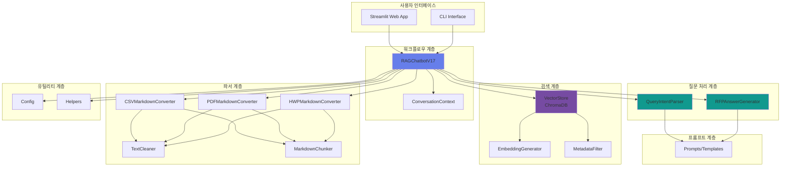
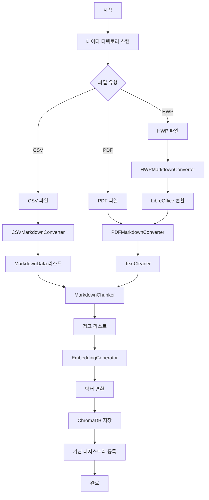
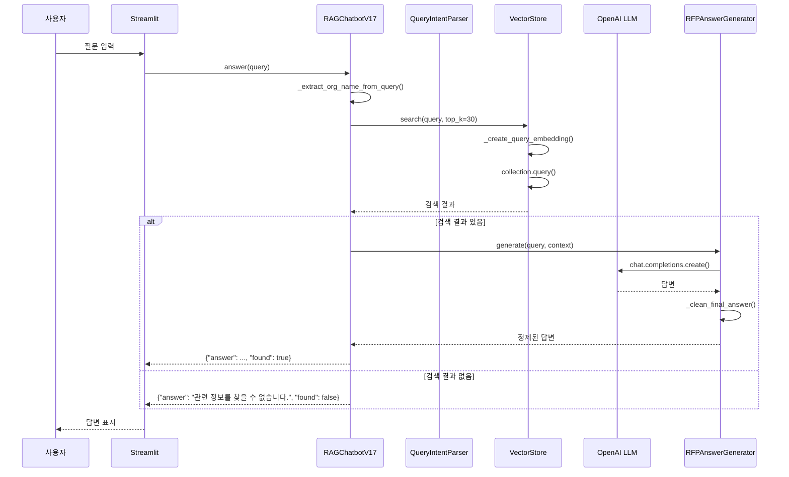
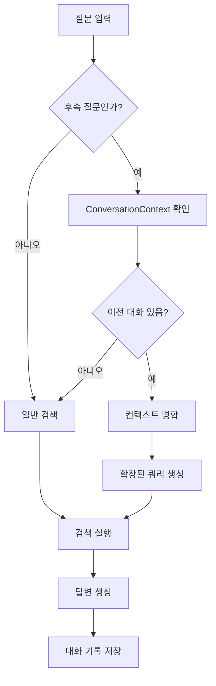

# 입찰메이트 RFP 챗봇 v17 - 기술 문서

> RFP(제안요청서) 문서 기반 지능형 질의응답 시스템의 상세 기술 문서입니다.

---

## 목차

1. [아키텍처 개요](#1-아키텍처-개요)
2. [그래프/워크플로우 모듈](#2-그래프워크플로우-모듈)
3. [파서 모듈](#3-파서-모듈)
4. [검색 모듈](#4-검색-모듈)
5. [프롬프트 템플릿](#5-프롬프트-템플릿)
6. [유틸리티 모듈](#6-유틸리티-모듈)
7. [데이터 흐름도](#7-데이터-흐름도)
8. [API 레퍼런스](#8-api-레퍼런스)
9. [전역 변수/상수 목록](#9-전역-변수상수-목록)

---

## 1. 아키텍처 개요

### 1.1 프로젝트 개요

**입찰메이트**는 대규모 B2G 입찰 RFP 문서에서 필요한 정보를 빠르고 정확하게 찾아주는 AI 기반 질의응답 시스템입니다.

### 1.2 기술 스택

| 분류 | 기술 | 버전 | 용도 |
|:---|:---|:---|:---|
| **언어** | Python | 3.10+ | 메인 개발 언어 |
| **LLM** | OpenAI gpt-4o-mini | latest | 질문 파싱, 답변 생성 |
| **추론 LLM** | OpenAI gpt-5-mini | latest | 복잡한 추론 |
| **임베딩** | OpenAI text-embedding-3-small | 1536 dim | 벡터화 |
| **벡터 DB** | ChromaDB | 0.4.0+ | 문서 저장, 검색 |
| **PDF 처리** | pdfplumber | 0.10.0+ | PDF 텍스트 추출 |
| **HWP 처리** | LibreOffice + pyhwpx | latest | HWP → PDF 변환 |
| **웹 프레임워크** | Streamlit | 1.20+ | 채팅 UI |
| **한국어 임베딩** | sentence-transformers | 2.2.0+ | 폴백 임베딩 |
| **데이터 처리** | pandas | 2.0.0+ | CSV 처리 |
| **트레이싱** | LangSmith | latest | LLM 호출 모니터링 |

### 1.3 디렉토리 구조

```
AI_7-team/
├── app/                          # Streamlit 웹 UI
│   └── main.py                   # 채팅 인터페이스
├── src/                          # 핵심 소스 코드
│   ├── graph/                    # LangGraph 워크플로우
│   │   ├── state.py             # 상태 정의 (QueryIntent, OrgInfo 등)
│   │   ├── nodes.py             # 질문 파싱, 답변 생성 노드
│   │   └── workflow.py          # 메인 RAG 챗봇 클래스
│   ├── parsers/                 # 문서 로더 및 파서
│   │   ├── csv_loader.py         # CSV 처리
│   │   ├── pdf_loader.py        # PDF 처리 (pdfplumber)
│   │   ├── hwp_loader.py        # HWP 처리 (LibreOffice)
│   │   ├── text_cleaner.py      # 텍스트 정제
│   │   ├── chunker.py          # 문서 청킹
│   │   └── __init__.py        # 모듈 내보내기
│   ├── retrievers/              # 검색 시스템
│   │   ├── embeddings.py        # OpenAI 임베딩
│   │   ├── vectorstore.py       # ChromaDB 벡터 저장소
│   │   ├── metadata_filter.py   # 메타데이터 필터링
│   │   └── __init__.py        # 모듈 내보내기
│   ├── prompts/                 # 프롬프트 템플릿
│   │   └── templates.py         # RAG 프롬프트
│   └── utils/                  # 유틸리티
│       ├── config.py            # 설정 관리
│       ├── helpers.py          # 헬퍼 함수
│       └── __init__.py        # 모듈 내보내기
├── scripts/                      # 유틸리티 스크립트
│   └── rebuild_db.py            # 벡터 DB 재구축
├── tests/                       # 테스트 코드
│   └── test_conversation.py     # 대화 기능 테스트
├── docs/                        # 문서
└── data/                        # 데이터 파일 (Git 제외)
```

### 1.4 전체 아키텍처 다이어그램



---

## 2. 그래프/워크플로우 모듈

그래프/워크플로우 모듈은 사용자 질문의 의도를 파악하고, 적절한 답변을 생성하는 핵심 로직을 담당합니다.

### 2.1 state.py - 데이터 클래스

#### OrgInfo

기관 정보를 저장하는 데이터 클래스입니다.

```python
@dataclass
class OrgInfo:
    name: str              # 기관명
    amount: str = ""       # 사업비 문자열
    amount_numeric: float = 0  # 사업비 수치
    project_name: str = "" # 사업명
    summary: str = ""      # 사업 요약
    open_date: str = ""    # 공개 일자
    file_format: str = ""  # 파일 형식 (PDF/HWP)
    has_pdf: bool = False  # PDF 보유 여부
    has_hwp: bool = False # HWP 보유 여부
```

#### MarkdownData

마크다운 변환 결과를 저장하는 데이터 클래스입니다.

```python
@dataclass
class MarkdownData:
    markdown: str          # 변환된 마크다운 텍스트
    org_name: str         # 기관명
    project_name: str     # 사업명
    amount: str          # 사업비
    summary: str = ""     # 사업 요약
    filename: str = ""    # 원본 파일명
    file_format: str = "" # 파일 형식
    row_num: int = 0     # CSV 행 번호
```

#### QueryIntent

사용자 질문의 의도를 저장하는 데이터 클래스입니다.

```python
@dataclass
class QueryIntent:
    query_type: str = "search"  # org, ranking, filter, category, search
    org_name: str = ""          # 기관명
    rank_order: str = ""         # asc, desc
    amount_min: int | None = None
    amount_max: int | None = None
    qualifications: list[str] = field(default_factory=list)
    categories: list[str] = field(default_factory=list)
    raw_query: str = ""         # 원본 질문
    confidence: float = 0.0     # 신뢰도 (0~1)
```

**질문 유형 (query_type):**
- `org`: 특정 기관에 대한 질문
- `ranking`: 랭킹 질문
- `filter`: 필터 조건 질문
- `category`: 카테고리별 검색
- `search`: 일반 검색

#### ConversationContext

대화 컨텍스트를 관리하는 클래스입니다.

```python
class ConversationContext:
    def __init__(self, max_history: int = 5) -> None:
        self.max_history = max_history
        self.history: list[dict[str, Any]] = []
        self.last_org: str | None = None
        self.last_query_type: str | None = None
```

**메서드:**
- `add_exchange(query, answer, intent)`: 대화 기록 추가
- `get_context_summary()`: 대화 컨텍스트 요약 반환
- `get_follow_up_context(current_query)`: 후속 질문 컨텍스트 반환

### 2.2 nodes.py - 그래프 노드

#### QueryIntentParser

LLM을 사용하여 질문 의도를 파악하는 파서 클래스입니다.

```python
class QueryIntentParser:
    def __init__(self, client: OpenAI | None):
        self.client = client

    def parse(self, query: str) -> QueryIntent:
        """질문을 분석하여 의도를 파악합니다."""

    def _parse_with_llm(self, query: str) -> QueryIntent:
        """LLM로 질문을 분석합니다."""

    def _parse_with_regex(self, query: str) -> QueryIntent:
        """정규식으로 질문을 분석합니다."""
```

**처리 흐름:**
1. LLM이 있으면 LLM로 우선 분석
2. 신뢰도가 0.7 미만이면 정규식으로 재분석
3. 더 높은 신뢰도의 결과 선택

#### RFPAnswerGenerator

간결한 RFP 답변을 생성하는 클래스입니다.

```python
class RFPAnswerGenerator:
    def __init__(self, client: OpenAI | None) -> None:
        self.client = client

    def generate(self, query: str, context: str) -> str:
        """간결한 RFP 답변을 생성합니다."""

    @staticmethod
    def _clean_final_answer(answer: str) -> str:
        """답변에서 "최종 답변:" 태그를 제거합니다."""
```

### 2.3 workflow.py - 메인 워크플로우

#### RAGChatbotV17

입찰메이트 RFP 챗봇 v17의 메인 클래스입니다.

```python
class RAGChatbotV17:
    def __init__(self, data_dir: str = None, db_path: str | None = None) -> None:
        """챗봇을 초기화합니다."""

    def _load_documents(self) -> None:
        """모든 문서를 로드하고 변환합니다."""

    def _load_csv_files(self, verbose: bool = False) -> None:
        """CSV 파일을 로드하고 변환합니다."""

    def _register_csv_orgs(self, markdowns: list) -> None:
        """CSV 기관 정보만 등록합니다."""

    def _add_csv_chunks(self, markdowns: list) -> None:
        """CSV 청크를 벡터 DB에 추가합니다."""

    def _create_org_info_from_markdown(self, md_data) -> Any:
        """마크다운 데이터에서 기관 정보를 생성합니다."""

    def _load_document_files(self, force_reload: bool = False) -> None:
        """PDF/HWP 파일을 로드하고 변환합니다."""

    def answer(self, query: str) -> dict[str, Any]:
        """질문에 답변합니다."""

    def _extract_org_name_from_query(self, query: str) -> str | None:
        """질문에서 기관명을 추출합니다."""

    def _create_multi_org_summary(self, results: list, query: str) -> dict[str, Any]:
        """여러 기관의 요약 답변을 생성합니다."""
```

---

## 3. 파서 모듈

파서 모듈은 다양한 형식의 문서(CSV, PDF, HWP)를 마크다운으로 변환하고 청킹하는 역할을 담당합니다.

### 3.1 csv_loader.py - CSV 로더

#### CSVMarkdownConverter

CSV 데이터를 마크다운으로 변환하는 클래스입니다.

```python
class CSVMarkdownConverter:
    @staticmethod
    def extract_org_name(filename: str) -> str:
        """파일명에서 기관명을 추출합니다."""

    @staticmethod
    def split_markdown_sections(markdown: str) -> list[str]:
        """마크다운을 섹션 단위로 분할합니다."""

    @staticmethod
    def filter_valid_sections(sections: list[str]) -> list[str]:
        """유효한 섹션만 필터링합니다."""

    def convert_row(self, row: dict[str, str]) -> MarkdownData:
        """CSV 한 행을 마크다운으로 변환합니다."""

    def convert_file(self, csv_path: str | Path) -> list[MarkdownData]:
        """CSV 파일 전체를 마크다운으로 변환합니다."""
```

**CSV 필드 처리:**
- `공고 번호`, `공고 차수`, `사업명`, `발주 기관`
- `사업 금액`, `공개 일자`, `입찰 참여 시작일`, `입찰 참여 마감일`
- `사업 요약`, `파일형식`, `파일명`, `텍스트`

### 3.2 pdf_loader.py - PDF 로더

#### PDFMarkdownConverter

PDF 문서를 마크다운으로 변환하는 클래스입니다.

```python
class PDFMarkdownConverter:
    @staticmethod
    def extract_org_name(filename: str) -> str:
        """파일명에서 기관명을 추출합니다."""

    @staticmethod
    def split_markdown_sections(markdown: str) -> list[str]:
        """마크다운을 섹션 단위로 분할합니다."""

    @staticmethod
    def filter_valid_sections(sections: list[str]) -> list[str]:
        """유효한 섹션만 필터링합니다."""

    def convert(self, pdf_path: str | Path, org_name: str | None = None) -> str:
        """PDF를 마크다운으로 변환합니다."""
```

**처리 과정:**
1. pdfplumber로 PDF 열기
2. 각 페이지에서 텍스트 추출
3. 줄바꿈 정규화
4. 페이지별 섹션으로 구성

### 3.3 hwp_loader.py - HWP 로더

#### HWPMarkdownConverter

HWP 문서를 마크다운으로 변환하는 클래스입니다.

```python
class HWPMarkdownConverter:
    def __init__(self) -> None:
        """HWP 변환기를 초기화합니다."""
        self.pdf_converter = PDFMarkdownConverter()
        self._check_libreoffice()

    def _check_libreoffice(self) -> None:
        """LibreOffice 가용성 확인."""

    def _find_libreoffice(self) -> str | None:
        """LibreOffice 실행 파일 경로를 찾습니다."""

    def convert(self, hwp_path: str | Path, org_name: str | None = None) -> str:
        """HWP를 마크다운으로 변환합니다."""

    def _extract_via_libreoffice(self, hwp_path: Path) -> str:
        """LibreOffice를 사용하여 HWP → PDF → 텍스트 추출."""

    def _extract_fallback(self, hwp_path: Path) -> str:
        """Fallback: 이진 데이터에서 텍스트 패턴 추출."""
```

**HWP 처리 과정:**
1. LibreOffice로 HWP → PDF 변환 (headless 모드)
2. 변환된 PDF에서 텍스트 추출
3. 실패 시 olefile로 메타데이터 추출 (fallback)

### 3.4 text_cleaner.py - 텍스트 정제

#### TextCleaner

텍스트 정규화 및 전처리를 수행하는 클래스입니다.

```python
class TextCleaner:
    STOP_WORDS = {
        '이다', '하다', '되다', '있다', '없다', '같다', '아니다',
        '이', '그', '저', '것', '등', '및', '또는', '혹은'
    }

    def __init__(self, normalize_newlines: bool = True,
                 remove_extra_spaces: bool = True,
                 remove_special_chars: bool = False,
                 min_line_length: int = 0):
        """텍스트 클리너를 초기화합니다."""

    def clean(self, text: str) -> str:
        """텍스트를 정리합니다."""

    def _normalize_newlines(self, text: str) -> str:
        """연속된 줄바꿈을 정리합니다."""

    def _remove_extra_spaces(self, text: str) -> str:
        """연속된 공백을 제거합니다."""

    def _remove_special_chars(self, text: str) -> str:
        """특수 문자를 제거합니다."""

    def _filter_lines(self, text: str) -> str:
        """최소 길이 미만의 줄을 제거합니다."""

    def extract_sentences(self, text: str) -> list[str]:
        """텍스트에서 문장을 추출합니다."""

    def extract_keywords(self, text: str, min_length: int = 2) -> list[str]:
        """텍스트에서 키워드를 추출합니다."""
```

### 3.5 chunker.py - 문서 청킹

#### Chunk

문서 청크 데이터 클래스입니다.

```python
@dataclass
class Chunk:
    text: str
    source: str
    org: str
    chunk_type: str = "unknown"
    metadata: dict[str, Any] = None

    def to_dict(self) -> dict[str, Any]:
        """딕셔너리로 변환합니다."""
```

#### MarkdownChunker

마크다운 문서를 청크로 분할하는 클래스입니다.

```python
class MarkdownChunker:
    def __init__(self, chunk_by_section: bool = True,
                 min_chunk_length: int = 50,
                 max_chunk_length: int = 2000,
                 overlap: int = 100):
        """청커를 초기화합니다."""

    def chunk_markdown(self, markdown: str, source: str,
                     org: str, chunk_type: str = "csv") -> list[Chunk]:
        """마크다운을 청크로 분할합니다."""

    def _chunk_by_section(self, markdown: str, source: str,
                        org: str, chunk_type: str) -> list[Chunk]:
        """섹션 단위로 청킹합니다."""

    def _chunk_by_size(self, markdown: str, source: str,
                     org: str, chunk_type: str) -> list[Chunk]:
        """크기 단위로 청킹합니다."""

    def chunk_csv_row(self, markdown: str, source: str,
                     org: str) -> list[Chunk]:
        """CSV 행 마크다운을 청킹합니다."""

    def chunk_document(self, content: str, filename: str,
                     org: str, is_pdf: bool) -> list[Chunk]:
        """문서 내용을 청킹합니다."""
```

---

## 4. 검색 모듈

검색 모듈은 문서의 벡터화, 저장, 검색을 담당합니다.

### 4.1 vectorstore.py - 벡터 저장소

#### VectorStore

마크다운 문서를 저장하고 검색하는 벡터 저장소 클래스입니다.

```python
class VectorStore:
    def __init__(self, db_path: str | None = None) -> None:
        """벡터 저장소를 초기화합니다."""

    def add_documents(self, chunks: list[dict[str, str]]) -> None:
        """문서 청크를 추가합니다."""

    def _create_embeddings(self, texts: list[str]) -> list[list[float]]:
        """텍스트 임베딩을 생성합니다."""

    def register_org(self, org_info: OrgInfo, preserve_existing: bool = True) -> None:
        """기관 정보를 등록합니다."""

    def _update_org_fields(self, existing: OrgInfo, new: OrgInfo) -> None:
        """기존 기관 정보의 누락된 필드를 업데이트합니다."""

    def search(self, query: str, top_k: int = 10) -> list[dict[str, Any]]:
        """문서를 검색합니다."""

    def _create_query_embedding(self, query: str) -> list[float]:
        """쿼리 임베딩을 생성합니다."""

    def _parse_search_results(self, response: dict) -> list[dict[str, Any]]:
        """검색 응답을 파싱합니다."""

    def get_ranking(self, field: str = "amount", top_n: int = 5,
                   reverse: bool = True) -> list[OrgInfo]:
        """랭킹을 조회합니다."""

    def normalize_org_name(self, org_name: str) -> str:
        """기관명을 정규화합니다."""
```

**ChromaDB 설정:**
- 컬렉션 이름: `rfp_docs_v17`
- 거리 공간: `cosine`
- 지속형 저장소 (PersistentClient)

**임베딩 전략:**
1. OpenAI API 키가 있으면 `text-embedding-3-small` 사용 (1536 dim)
2. 없으면 `sentence-transformers` 로컬 모델 사용

### 4.2 embeddings.py - 임베딩 생성

#### EmbeddingGenerator

텍스트 임베딩을 생성하는 클래스입니다.

```python
class EmbeddingGenerator:
    def __init__(self, api_key: str | None = None):
        """임베딩 생성기를 초기화합니다."""

    def _init_local_model(self) -> None:
        """로컬 모델을 초기화합니다."""

    def embed_texts(self, texts: list[str]) -> list[list[float]]:
        """텍스트 리스트를 임베딩합니다."""

    def embed_query(self, query: str) -> list[float]:
        """쿼리를 임베딩합니다."""

    def _embed_with_openai(self, texts: list[str]) -> list[list[float]]:
        """OpenAI로 텍스트를 임베딩합니다."""

    def _embed_with_local(self, texts: list[str]) -> list[list[float]]:
        """로컬 모델로 텍스트를 임베딩합니다."""

    @property
    def dimension(self) -> int | None:
        """임베딩 차원을 반환합니다."""
```

**임베딩 모델:**
- OpenAI: `text-embedding-3-small` (1536 차원)
- 로컬 폴백: `distiluse-base-multilingual-cased-v2`

### 4.3 metadata_filter.py - 메타데이터 필터링

#### MetadataFilter

메타데이터 필터 클래스입니다.

```python
class MetadataFilter:
    def __init__(self, source_filter: list[str] | None = None,
                 org_filter: list[str] | None = None,
                 type_filter: list[str] | None = None):
        """메타데이터 필터를 초기화합니다."""

    def filter_results(self, results: list[dict[str, Any]]) -> list[dict[str, Any]]:
        """검색 결과를 필터링합니다."""

    def _matches_filters(self, metadata: dict[str, Any]) -> bool:
        """메타데이터가 필터와 일치하는지 확인합니다."""

    def add_source_filter(self, source: str) -> None:
        """소스 필터를 추가합니다."""

    def add_org_filter(self, org: str) -> None:
        """기관 필터를 추가합니다."""

    def add_type_filter(self, type_filter: str) -> None:
        """타입 필터를 추가합니다."""

    def clear_filters(self) -> None:
        """모든 필터를 제거합니다."""
```

#### AmountFilter

금액 기반 필터 클래스입니다.

```python
class AmountFilter:
    @staticmethod
    def parse_amount_range(query: str) -> tuple[int | None, int | None]:
        """질문에서 금액 범위를 파싱합니다."""

    @staticmethod
    def filter_by_amount(orgs: list,
                       amount_min: int | None = None,
                       amount_max: int | None = None) -> list:
        """기관 리스트를 금액으로 필터링합니다."""
```

**금액 파싱 패턴:**
- `5억에서 10억 사이`: 범위
- `10억 이상`: 최소값
- `5억 미만`: 최대값
- `~` 패턴 지원

---

## 5. 프롬프트 템플릿

LLM에 전달되는 프롬프트 템플릿을 정의합니다.

### 5.1 MARKDOWN_TEMPLATE

CSV 데이터를 마크다운으로 변환하는 템플릿입니다.

```python
MARKDOWN_TEMPLATE = """# {org_name} {project_name}

## 기본 정보
- **공고 번호**: {notice_num}
- **공고 차수**: {notice_round}
- **사업명**: {project_name}
- **발주 기관**: {org_name}
- **사업 금액**: {amount}
- **공개 일자**: {open_date}
- **입찰 시작일**: {start_date}
- **입찰 마감일**: {end_date}

## 사업 요약
{summary}

## 파일 정보
- **파일 형식**: {file_format}
- **파일명**: {filename}

## 원본 문서 내용
{original_text}
"""
```

### 5.2 RFP_SYSTEM_PROMPT

RFP 분석가 시스템 프롬프트입니다.

```python
RFP_SYSTEM_PROMPT = """당신은 입찰메이트 엔지니어링 팀의 RFP 분석가입니다.
B2G 입찰 지원을 위해 **입찰 참여 조건**을 신속하게 추출합니다.

## 답변 원칙
1. **자연스러운 문장** - 틀에 박히지 말고 말하듯이
2. **질문에 먼저 답변** - 묻는 것에 1-2문장으로 직접 답하고, 추가 정보 제공
3. **정확한 정보** - 숫자, 날짜는 구체적으로
4. **있는 정보만** - 문서에 없으면 "문서에 명시되어 있지 않음"

## 답변 구조
[질문에 대한 직접 답변]
[입찰 참여에 도움 되는 추가 정보]

출처: 📊 CSV / 📄 PDF / 📝 HWP
"""
```

### 5.3 ANSWER_GENERATION_PROMPT

답변 생성 프롬프트입니다.

```python
ANSWER_GENERATION_PROMPT = """## 질문: {query}

## 검색된 RFP 문서:
{context}

## 답변 요청
당신은 입찰메이트 엔지니어링 팀의 RFP 분석가입니다.
**자연스러운 문장**으로 질문에 답변하고, 추가 정보를 제공하세요.

### 답변 원칙
1. **자연스러운 문장** - 틀에 박히지 말고 말하듯이
2. **질문에 직접 답변** - 묻는 것에 먼저 답하고, 추가 정보로 확장
3. **정확한 숫자/날짜** - "약", "정도" 피하고 구체적 값
4. **있는 정보만** - 문서에 없으면 "문서에 명시되어 있지 않음"

### 답변 구조
1. **주 답변**: 질문에 대한 직접적 답변 (1-2문장)
2. **추가 정보**: 입찰 참여에 도움 되는 상세 정보
3. **출처**: 정보 출처 (CSV/PDF/HWP)
"""
```

### 5.4 INTENT_ANALYSIS_PROMPT

질문 의도 분석 프롬프트입니다.

```python
INTENT_ANALYSIS_PROMPT = """당신은 RFP 입찰 질문 분석 전문가입니다.
사용자 질문을 분석하여 JSON으로 응답하세요.

## 질문 유형
1. **org**: 특정 기관에 대한 질문
2. **ranking**: 랭킹 질문
3. **filter**: 필터 질문
4. **category**: 카테고리 질문
5. **search**: 일반 검색

## 추출할 정보
- query_type: 질문 유형 (위 5개 중 하나)
- org_name: 기관명 (있는 경우만)
- rank_order: 랭킹 순서 ("desc"=많은 순, "asc"=적은 순)
- amount_min: 최소 금액 (원 단위 정수, 없으면 null)
- amount_max: 최대 금액 (원 단위 정수, 없으면 null)
- qualifications: 자격 조건 리스트
- categories: 카테고리 리스트
- confidence: 신뢰도 (0~1 사이 실수)

## 금액 변환
- 1억 = 100,000,000
- 1만 = 10,000

## JSON 응답 형식:
{{
  "query_type": "filter",
  "org_name": null,
  "rank_order": "",
  "amount_min": 500000000,
  "amount_max": 1000000000,
  "qualifications": [],
  "categories": [],
  "confidence": 0.95
}}

## 질문: {query}

JSON만 반환하세요:
"""
```

### 5.5 RFP_EXTRACTION_PROMPT

RFP 핵심 정보 추출 프롬프트입니다.

```python
RFP_EXTRACTION_PROMPT = """## 기관: {org_name}
## 사업명: {project_name}

## 검색된 문서:
{context}

## 요청: 위 문서에서 RFP 핵심 정보만 간결하게 추출하세요.
불릿 포인트로 정리하고, 다음 항목 중 있는 것만 포함:
- 사업 기간 (착수일, 완료일)
- 제출 마감일
- 주요 요구 사항/기술 요건
- 제출 서류

없는 항목은 제외하고, 3줄 이내로 간결하게 작성하세요.
"""
```

---

## 6. 유틸리티 모듈

유틸리티 모듈은 설정 관리와 헬퍼 함수를 제공합니다.

### 6.1 config.py - 설정 관리

#### 환경 변수

| 변수명 | 타입 | 기본값 | 설명 |
|:---|:---|:---|:---|
| `OPENAI_API_KEY` | str\|None | None | OpenAI API 키 |
| `EMBEDDING_MODEL` | str | "text-embedding-3-small" | 임베딩 모델 |
| `DEFAULT_MODEL` | str | "gpt-4o-mini" | 기본 LLM 모델 |
| `REASONING_MODEL` | str | "gpt-5-mini" | 추론용 LLM |
| `LANGSMITH_API_KEY` | str\|None | None | LangSmith API 키 |
| `LANGSMITH_TRACING` | bool | false | LangSmith 트레이싱 활성화 |
| `LANGSMITH_ENDPOINT` | str | "https://api.smith.langchain.com/" | LangSmith 엔드포인트 |
| `LANGSMITH_PROJECT` | str | "biddingmate_jh" | LangSmith 프로젝트명 |
| `HF_TOKEN` | str\|None | None | HuggingFace 토큰 |

#### 매직 넘버 (Magic Numbers)

```python
MAX_TEXT_LENGTH: int = 5000       # 최대 텍스트 길이
MIN_SECTION_LENGTH: int = 50       # 최소 섹션 길이
MAX_PAGES: int = 20              # 최대 페이지 수
DEFAULT_TOP_K: int = 10          # 기본 검색 결과 수
DEFAULT_TOP_N: int = 5           # 기본 랭킹 수
CHUNK_HASH_MOD: int = 1_000_000  # 청크 해시 모듈로
AMOUNT_UNITS: dict = {
    "억": 100_000_000,
    "만": 10_000
}
```

#### 한국어 설정

```python
JOSA_LIST: list[str] = [
    '의', '은', '는', '이', '가', '께서', '에서', '에게'
]
```

#### 기관명 별칭

```python
ORG_ALIASES: dict[str, str] = {
    "서울시": "서울특별시",
    "고려대": "고려대학교",
    "서울시립대": "서울시립대학교",
}
```

#### 질문 유형별 키워드

```python
RANKING_KEYWORDS: list[str] = [
    "가장", "최고", "최소", "최대", "제일", "top", "ranking", "순위"
]
MAX_RANKING_KEYWORDS: list[str] = ["많은", "높은", "큰"]
MIN_RANKING_KEYWORDS: list[str] = ["적은", "낮은", "작은"]
```

#### 헬퍼 함수

```python
def get_data_dir() -> Path:
    """데이터 디렉토리 경로를 반환합니다."""

def get_default_db_path() -> str:
    """기본 DB 경로를 반환합니다."""
```

### 6.2 helpers.py - 헬퍼 함수

#### 텍스트 처리 함수

```python
def remove_josa(name: str) -> str:
    """기관명에서 한국어 조사를 제거합니다."""

def normalize_newlines(text: str) -> str:
    """연속된 줄바꿈을 정리합니다."""
```

#### 금액 처리 함수

```python
def format_amount(amount_value: float) -> str:
    """금액을 읽기 쉬운 한국어 형식으로 포맷팅합니다."""
    # 예: 11270000000 -> "약 112.7억 원 (11,270,000,000원)"

def parse_amount(amount_str: str) -> int:
    """문자열 금액을 정수로 변환합니다."""

def extract_amount_from_text(text: str) -> tuple[str, int]:
    """PDF/HWP 텍스트에서 사업비 금액을 추출합니다."""
```

**금액 추출 패턴:**
- `사업비 : 금(X)원`
- `금액 :(X)원`
- `금(X)원`
- `사업비 :(X)원`
- `계약금액 :(X)원`
- `예산 :(X)원`
- `총사업비 :(X)원`
- `사업비 :(X.X)억원` / `사업비 :(X)만원`

---

## 7. 데이터 흐름도

### 7.1 문서 로드 파이프라인



**상세 단계:**

1. **파일 스캔**: `data/` 디렉토리에서 CSV, PDF, HWP 파일 검색
2. **CSV 처리**:
   - `CSVMarkdownConverter.convert_file()`로 각 행 변환
   - `MarkdownData` 객체 생성
   - 기관 레지스트리에 등록
3. **PDF 처리**:
   - `PDFMarkdownConverter.convert()`로 텍스트 추출
   - `TextCleaner`로 정제
   - 섹션 단위 분할
4. **HWP 처리**:
   - `HWPMarkdownConverter.convert()`로 LibreOffice 변환
   - PDF → 텍스트 추출
   - 실패 시 olefile로 메타데이터 추출
5. **청킹**:
   - `MarkdownChunker`로 섹션 단위 청킹
   - 최소 길이 필터링
6. **임베딩**:
   - `EmbeddingGenerator.embed_texts()`
   - OpenAI 또는 로컬 모델
7. **저장**:
   - ChromaDB에 벡터+메타데이터 저장
   - 기관 레지스트리 업데이트

### 7.2 질문-답변 처리 파이프라인



**상세 단계:**

1. **질문 수신**: Streamlit 채팅 인터페이스에서 질문 입력
2. **기관명 추출**: `_extract_org_name_from_query()`로 기관명 파악
3. **검색 실행**:
   - 기관명이 있으면 해당 기관 필터링 검색
   - 없으면 전체 검색
   - `VectorStore.search(top_k=30)`
4. **결과 확인**:
   - 결과가 없으면 "관련 정보를 찾을 수 없습니다" 반환
5. **답변 생성**:
   - 검색된 컨텍스트 구성
   - `RFPAnswerGenerator.generate()`
   - LLM으로 답변 생성
6. **답변 정제**: `_clean_final_answer()`로 불필요한 태그 제거
7. **응답 반환**: JSON 형태로 답변 반환

### 7.3 후속 질문 처리 흐름



**후속 질문 키워드:**
- `그거`, `그것`, `그`, `거기`, `그곳`
- `언제`, `얼마`, `어디`, `누구`
- `더`, `또`, `다른`

---

## 8. API 레퍼런스

### 8.1 RAGChatbotV17

메인 챗봇 클래스입니다.

#### `__init__(data_dir=None, db_path=None)`

챗봇을 초기화합니다.

**파라미터:**
- `data_dir` (str, optional): 데이터 디렉토리 경로. 기본값 `"data"`
- `db_path` (str, optional): 벡터 DB 경로. 기본값 `"{data_dir}/chroma_db_v17"`

**반환값:** 없음

#### `answer(query: str) -> dict[str, Any]`

질문에 답변합니다.

**파라미터:**
- `query` (str): 사용자 질문

**반환값:**
```python
{
    "answer": str,      # 답변 텍스트
    "found": bool       # 정보 발견 여부
}
```

### 8.2 VectorStore

벡터 저장소 클래스입니다.

#### `__init__(db_path=None)`

벡터 저장소를 초기화합니다.

**파라미터:**
- `db_path` (str, optional): DB 경로. 기본값은 환경 변수 또는 `"./data/chroma_db_v17"`

#### `add_documents(chunks: list[dict]) -> None`

문서 청크를 추가합니다.

**파라미터:**
- `chunks`: 청크 딕셔너리 리스트
  ```python
  [
      {
          "text": "청크 텍스트",
          "source": "파일명",
          "org": "기관명",
          "type": "csv|pdf|hwp"
      },
      ...
  ]
  ```

#### `search(query: str, top_k=10) -> list[dict]`

문서를 검색합니다.

**파라미터:**
- `query` (str): 검색 쿼리
- `top_k` (int): 반환할 결과 수. 기본값 10

**반환값:**
```python
[
    {
        "text": "검색된 텍스트",
        "metadata": {"source": "...", "org": "...", "type": "..."}
    },
    ...
]
```

#### `register_org(org_info: OrgInfo, preserve_existing=True) -> None`

기관 정보를 등록합니다.

**파라미터:**
- `org_info` (OrgInfo): 기관 정보 객체
- `preserve_existing` (bool): 기존 정보 보존 여부. 기본값 True

#### `get_ranking(field="amount", top_n=5, reverse=True) -> list[OrgInfo]`

랭킹을 조회합니다.

**파라미터:**
- `field` (str): 정렬 기준 필드. 기본값 `"amount"`
- `top_n` (int): 반환할 개수. 기본값 5
- `reverse` (bool): 내림차순 여부. 기본값 True

**반환값:** 정렬된 `OrgInfo` 리스트

### 8.3 QueryIntentParser

질문 의도 파서 클래스입니다.

#### `parse(query: str) -> QueryIntent`

질문을 분석하여 의도를 파악합니다.

**파라미터:**
- `query` (str): 사용자 질문

**반환값:** `QueryIntent` 객체

### 8.4 RFPAnswerGenerator

답변 생성기 클래스입니다.

#### `generate(query: str, context: str) -> str`

간결한 RFP 답변을 생성합니다.

**파라미터:**
- `query` (str): 사용자 질문
- `context` (str): 검색된 문서 컨텍스트

**반환값:** 생성된 답변 문자열

### 8.5 CSVMarkdownConverter

CSV 변환기 클래스입니다.

#### `convert_file(csv_path: str | Path) -> list[MarkdownData]`

CSV 파일 전체를 마크다운으로 변환합니다.

**파라미터:**
- `csv_path` (str | Path): CSV 파일 경로

**반환값:** `MarkdownData` 리스트

#### `convert_row(row: dict) -> MarkdownData`

CSV 한 행을 마크다운으로 변환합니다.

**파라미터:**
- `row` (dict): CSV 행 딕셔너리

**반환값:** `MarkdownData` 객체

### 8.6 PDFMarkdownConverter

PDF 변환기 클래스입니다.

#### `convert(pdf_path: str | Path, org_name=None) -> str`

PDF를 마크다운으로 변환합니다.

**파라미터:**
- `pdf_path` (str | Path): PDF 파일 경로
- `org_name` (str, optional): 기관명. 기본값은 파일명에서 추출

**반환값:** 변환된 마크다운 문자열

### 8.7 HWPMarkdownConverter

HWP 변환기 클래스입니다.

#### `convert(hwp_path: str | Path, org_name=None) -> str`

HWP를 마크다운으로 변환합니다.

**파라미터:**
- `hwp_path` (str | Path): HWP 파일 경로
- `org_name` (str, optional): 기관명. 기본값은 파일명에서 추출

**반환값:** 변환된 마크다운 문자열

### 8.8 MarkdownChunker

청커 클래스입니다.

#### `chunk_markdown(markdown, source, org, chunk_type="csv") -> list[Chunk]`

마크다운을 청크로 분할합니다.

**파라미터:**
- `markdown` (str): 마크다운 텍스트
- `source` (str): 소스 파일명
- `org` (str): 기관명
- `chunk_type` (str): 청크 타입. 기본값 `"csv"`

**반환값:** `Chunk` 리스트

### 8.9 헬퍼 함수

#### `format_amount(amount_value: float) -> str`

금액을 한국어 형식으로 포맷팅합니다.

**파라미터:**
- `amount_value` (float): 금액 값

**반환값:** 포맷된 문자열
- 예: `11270000000` → `"약 112.7억 원 (11,270,000,000원)"`

#### `parse_amount(amount_str: str) -> int`

문자열 금액을 정수로 변환합니다.

**파라미터:**
- `amount_str` (str): 금액 문자열

**반환값:** 금액 정수값

#### `remove_josa(name: str) -> str`

기관명에서 한국어 조사를 제거합니다.

**파라미터:**
- `name` (str): 기관명

**반환값:** 조사가 제거된 기관명

---

## 9. 전역 변수/상수 목록

### 9.1 환경 변수 리스트

| 변수명 | 타입 | 필수 | 기본값 | 설명 |
|:---|:---|:---|:---|:---|
| `OPENAI_API_KEY` | string | 필수 | - | OpenAI API 키 |
| `EMBEDDING_MODEL` | string | 선택 | `text-embedding-3-small` | 임베딩 모델 |
| `DEFAULT_MODEL` | string | 선택 | `gpt-4o-mini` | 기본 LLM 모델 |
| `REASONING_MODEL` | string | 선택 | `gpt-5-mini` | 추론용 LLM |
| `LANGSMITH_API_KEY` | string | 선택 | - | LangSmith API 키 |
| `LANGSMITH_TRACING` | boolean | 선택 | `false` | LangSmith 트레이싱 |
| `LANGSMITH_ENDPOINT` | string | 선택 | `https://api.smith.langchain.com/` | LangSmith 엔드포인트 |
| `LANGSMITH_PROJECT` | string | 선택 | `biddingmate_jh` | LangSmith 프로젝트명 |
| `LANGFUSE_PUBLIC_KEY` | string | 선택 | - | Langfuse 공개 키 |
| `LANGFUSE_SECRET_KEY` | string | 선택 | - | Langfuse 시크릿 키 |
| `HF_TOKEN` | string | 선택 | - | HuggingFace 토큰 |

### 9.2 매직 넘버

| 상수명 | 값 | 설명 |
|:---|:---|:---|
| `MAX_TEXT_LENGTH` | 5000 | 최대 텍스트 길이 |
| `MIN_SECTION_LENGTH` | 50 | 최소 섹션 길이 |
| `MAX_PAGES` | 20 | 최대 PDF 페이지 수 |
| `DEFAULT_TOP_K` | 10 | 기본 검색 결과 수 |
| `DEFAULT_TOP_N` | 5 | 기본 랭킹 결과 수 |
| `CHUNK_HASH_MOD` | 1,000,000 | 청크 ID 해시 모듈로 |

### 9.3 금액 단위

| 단위 | 값 | 설명 |
|:---|:---|:---|
| `억` | 100,000,000 | 1억 원 |
| `만` | 10,000 | 1만 원 |

### 9.4 기관명 별칭

| 별칭 | 정규화된 이름 |
|:---|:---|
| `서울시` | `서울특별시` |
| `고려대` | `고려대학교` |
| `서울시립대` | `서울시립대학교` |

### 9.5 질문 유형 키워드

#### 랭킹 질문 키워드
- `가장`, `최고`, `최소`, `최대`, `제일`, `top`, `ranking`, `순위`

#### 최대 랭킹 키워드
- `많은`, `높은`, `큰`

#### 최소 랭킹 키워드
- `적은`, `낮은`, `작은`

#### 필터 질문 키워드
- `이상`, `이하`, `초과`, `미만`, `사이`

#### 후속 질문 키워드
- `그거`, `그것`, `그`, `거기`, `그곳`
- `언제`, `얼마`, `어디`, `누구`
- `더`, `또`, `다른`

### 9.6 한국어 조사 리스트

- `의`, `은`, `는`, `이`, `가`, `께서`, `에서`, `에게`

### 9.7 파일 확장자

| 형식 | 확장자 | 처리 클래스 |
|:---|:---|:---|
| CSV | `.csv` | `CSVMarkdownConverter` |
| PDF | `.pdf` | `PDFMarkdownConverter` |
| HWP | `.hwp`, `.hwpx` | `HWPMarkdownConverter` |

---

## 부록

### A. 의존성

```
# OpenAI
openai>=1.0.0

# 벡터 DB
chromadb>=0.4.0

# PDF 처리
pdfplumber>=0.10.0

# 환경 변수
python-dotenv>=1.0.0

# 웹 프레임워크
streamlit>=1.20.0

# 한국어 임베딩 (폴백)
sentence-transformers>=2.2.0

# 데이터 처리
pandas>=2.0.0
```

### B. 실행 방법

#### Streamlit 웹 버전
```bash
streamlit run app/main.py
```

#### CLI 버전
```bash
python -m src.graph.workflow
```

#### DB 재구축
```bash
python scripts/rebuild_db.py
```

---

**문서 버전:** v17
**최종 수정:** 2026년 2월 12일
**팀:** 7팀
