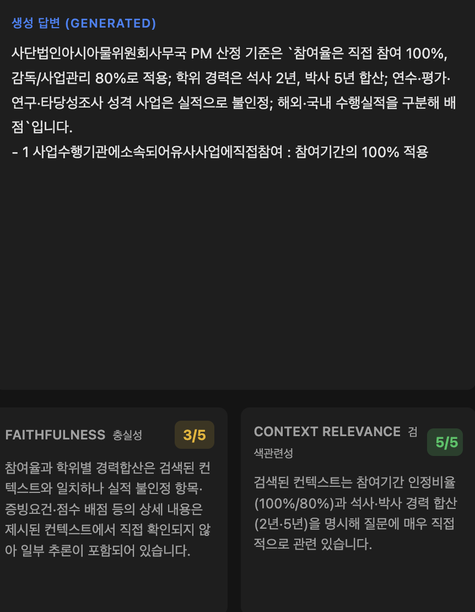
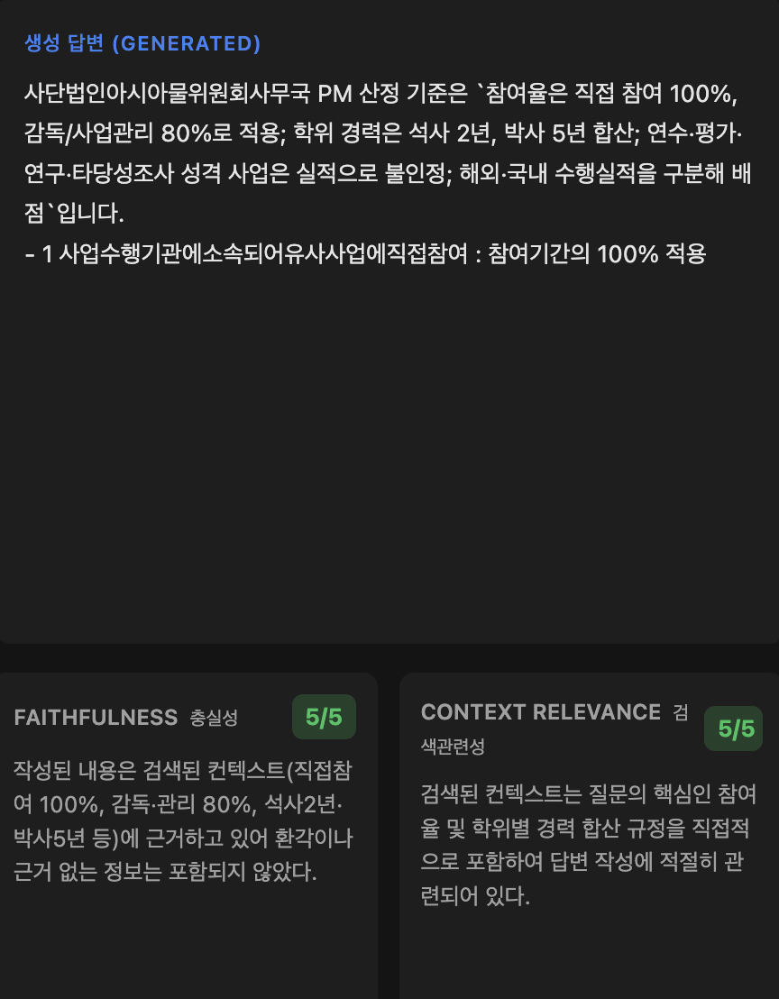

# 발표용 실험 순서 재정리 (DB Handoff ~ 현재)

## 기준
- 근거 문서:
  - `eval_resources/ab_integrated_experiment_log_db_handoff_to_now.md`
  - `origin/dev:eval_resources/SESSION_TIMELINE_DB_HANDOFF_TO_NOW_2026-02-26.md`
- 정렬 원칙:
  - 타임라인 순서 우선
  - 레이턴시 실험은 `CSV 숏서킷 -> 2트랙 구축/개선` 순서 유지

## 최종 발표 순서
1. 실험 1: 신뢰성 기반 확보 (1-1 평가 정합화, 1-2 DB handoff 검증)
2. 실험 2: CSV short-circuit 저지연 경로 구축
3. 실험 3: 2트랙 생성 경로 구축 + 개선(통합)
4. 실험 4: chunk recall 개선(측정 정합 + 개선 시도 분리)
5. 실험 5: eval_017 목적형 개선(표/이미지 수치 추출)
6. 실험 6: evidence-bounded generation 확정
7. 최종 정리: 기준선 대비 최종 운영 지표 정리

---

## 1) 실험 1: 신뢰성 기반 확보
핵심: "평가 정합화 + DB 검증을 하나의 신뢰성 축으로 통합."

공통 A/B(통일, 신뢰 비교군):
- A: `before_dev`
- B: `current_patch`
- 사유: DB 불안정 진단값(`testdb`)을 공식 비교군에서 제외하고, 재현 가능한 기준선/패치 기준으로 통일

| 지표 | A (before_dev) | B (current_patch) | 변화율 |
|---|---:|---:|---:|
| Correctness | 1.80 | 3.75 | +108.33% |
| Answer Coverage | 1.60 | 3.35 | +109.38% |
| Faithfulness | 3.95 | 4.35 | +10.13% |
| Context Relevance | 3.75 | 4.65 | +24.00% |
| Recall@5 (source) | 0.75 | 0.90 | +20.00% |
| MRR (source) | 0.75 | 0.90 | +20.00% |
| 매크로(C/AC/F/CR) | 2.775 | 4.025 | +45.05% |

### 1-1) 평가 정합화
- 목적: 측정 신뢰도 확보(확장자 동치, 멀티소스 hit/recall/mrr 일관화)
- 핵심 효과: 정답 판정 왜곡 제거, 이후 실험의 해석 가능성 확보

### 1-2) DB handoff 검증
- 목적: 코드 영향과 DB 품질 영향을 분리
- 반영 수정:
  - `048d68a`: single-doc ranking/fallback 정밀화(노이즈 source 노출 억제)
  - `d6ca724`: precision fact anchor chunk 가중 보강
  - `f5cc477`: source metadata 정규화(확장자/표기 불일치 보정)
  - `e5a18a4`: source-based fallback + eval alignment(저신뢰 검색 시 안전 fallback)
- 진단 스냅샷(참고):
  - `testdb_20260226` (2026-02-26 11:06): C 1.20 / AC 1.00 / R 0.20 / MRR 0.20
  - `backupdb_20260226` (2026-02-26 11:18): C 3.75 / AC 3.50 / R 0.90 / MRR 0.90

전환: "신뢰성 기반이 확보되었으니, 성능/속도 병목을 줄이는 실험으로 이동."

---

## 2) 실험 2: CSV short-circuit 저지연 경로 구축
핵심: "CSV 질의는 무거운 경로를 타지 않게 분기."

비교 기준: `eval_results_current_full20_evidence_strict.json` 내 CSV vs Non-CSV 평균

| 단계 레이턴시 | CSV | Non-CSV | 변화율(CSV 기준) |
|---|---:|---:|---:|
| analyze_query | 1.7196s | 11.2681s | -84.74% |
| retrieve | 0.0000s | 0.5941s | -100.00% |
| extract_evidence | 0.0000s | 0.0371s | -100.00% |
| generate | 0.0000s | 25.2148s | -100.00% |
| total (평균) | 1.7196s | 37.1141s | -95.37% |

전환: "CSV는 분기됐지만, 일반 질의는 생성 경로 최적화가 필요."

---

## 3) 실험 3: 2트랙 생성 경로 구축 + 개선(통합)
핵심: "근거 추출 후 생성 재진입 2트랙을 도입하고, extractive 우선으로 과개입을 줄였다."

### 3-1) 구축 효과
비교 기준: `current_patch -> dev_dataset_latest`

| 지표 | A (current_patch) | B (dev_dataset_latest) | 변화율 |
|---|---:|---:|---:|
| Correctness | 3.75 | 3.60 | -4.00% |
| Answer Coverage | 3.35 | 3.45 | +2.99% |
| Recall@5 (source) | 0.90 | 1.00 | +11.11% |
| MRR (source) | 0.90 | 0.95 | +5.56% |
| Faithfulness | - | 4.25 | - |
| Context Relevance | - | 4.80 | - |

관측: 구축 직후 baseline은 총 latency `20.314s`, 평균 generate `17.28s`.

### 3-2) 개선 효과(extractive 우선)
비교 기준: `dev_dataset_latest -> extractive_only_20260226`

| 지표 | A (dev_dataset_latest) | B (extractive_only) | 변화율 |
|---|---:|---:|---:|
| Correctness | 3.60 | 3.70 | +2.78% |
| Answer Coverage | 3.45 | 3.60 | +4.35% |
| Faithfulness | 4.25 | 4.10 | -3.53% |
| Context Relevance | 4.80 | 4.75 | -1.04% |
| Recall@5 (source) | 1.00 | 1.00 | +0.00% |
| MRR (source) | 0.95 | 0.95 | +0.00% |
| 총 latency | 20.314s | 10.886s | -46.41% |
| 평균 generate | 17.28s | 8.31s | -51.91% |
| answer_mode generative 개수 | 6 | 1 | -83.33% |

전환: "속도 구조가 안정화됐으니, 데이터 영향(DB)을 분리 검증."

### 3-3) 답변 품질 변화 증거
요청사항 반영:
- `CSV 숏서킷 전/후`와 `비CSV 개선 사례`를 분리
- 비CSV는 체감 가능한 개선 문항만 선별

#### A. CSV 숏서킷 전/후 증거

##### eval_001
- 질문: 강릉어선안전조업국 상황관제시스템 구축 사업의 총 사업 예산(부가가치세 포함)은 얼마입니까?
- 정답(요약): 사업 금액은 210,000,000원(금 이억일천만원, VAT 포함)입니다.
- C+AC: 2 -> 10 (+8)

| 단계 | C/AC/F/CR | hit/recall | generate(s) | 실제응답 발췌 |
|---|---|---|---:|---|
| 숏서킷 전 | 1/1/5/1 | None/0.0 | 0.00 | 수협중앙회 문서 기준 사업비는 2,996,000,000원입니다. 근거 요약 - 총사업비 : 2,996 백만원(자담 50%, 국고보조 50%) 출처 수협중앙회_수협중앙회 수산물사이버직매장 시스템 재구축 ISMP 수립 입.pdf p.5 |
| 숏서킷 후(기준선) | 5/5/4/5 | 1/1.0 | 0.00 | ### 핵심 답변 - 수협중앙회 사업비은(는) `약 2.1억 원 (210,000,000원) (부가가치세 포함)`입니다. ### 근거 요약 - 근거 문장을 확인하지 못했습니다. ### 출처 - 수협중앙회_강릉어선안전조업국 상황관제시스템 구축.hwp (CSV) |

핵심 해석: CSV 숏서킷은 숫자형/일정형 질문에서 오답 경로를 차단하고 정답값으로 빠르게 수렴시킴.

#### B. 비CSV 개선 사례 1번째

##### eval_010 
- 요약: 비CSV 개선 A - 미검출(None) -> 정확 답변(협상적격자 85% 기준)으로 회복
- 질문: 국가과학기술지식정보서비스 통합정보시스템 고도화 용역에서 기술능력 평가점수로 협상적격자를 선정할 때 기준은 무엇인가요?
- 정답(요약): 기술능력 평가분야 배점한도의 85% 이상인 제안사를 협상적격자로 선정합니다.
- C+AC: 0 -> 10 -> 10 -> 10 (최종-초기 +10)

| 단계 | answer_mode | C/AC/F/CR | hit/recall | generate(s) | 실제응답 발췌 |
|---|---|---|---|---:|---|
| 초기 기준선(숏서킷 전) | - | 0/0/5/0 | None/0.0 | 0.00 | 제공된 문서에서 `국가과학기술지식정보서비스` 관련 정보를 찾지 못했습니다. 해당 기관 문서가 인덱싱되어 있는지 확인해 주세요. |
| 2트랙 전(패치기준선) | - | 5/5/4/5 | 1/1.0 | 0.00 | ### 핵심 답변 - 국가과학기술지식정보서비스 협상적격자 선정 기준은 `기술능력 평가점수 배점한도의 85% 이상`입니다. ### 근거 요약 - 대상제도: 11. 기술능력평가비중(90%)도입, 대상: 대상, 적용여부: 적용, 비 고: 기술능력대가격점수비중90:10 제시(p.42) - 종합평가점수(100 점) = 기술능력평가(90 점) + 입찰가격평가(10 점) ### 출처 -... |

#### C. 비CSV 개선 사례 2번째

##### eval_016
- 요약: 비CSV 개선 B - 2트랙 붕괴 응답 -> 추출우선에서 근거요약형으로 복구
- 질문: 세종테크노파크 인사정보 전산시스템 구축 사업에서 관련 소프트웨어 현황 및 개선사항을 정리해줘
- 정답(요약): 세종테크노파크 인사정보 전산시스템 구축 사업의 관련 소프트웨어 현황 및 개선사항은 다음과 같다. 1) 정보시스템/네트워크 구성은 보안상 비공개, 2) 필요 시 발주기관 사전문의 후 열람 가능, 3) AS-IS 분석 기반 TO-BE 설계 및 연계/표준화/권한체계 개선 요구.
- C+AC: 3 -> 3 -> 2 -> 9 (최종-초기 +6)

| 단계 | answer_mode | C/AC/F/CR | hit/recall | generate(s) | 실제응답 발췌 |
|---|---|---|---|---:|---|
| 2트랙 후(생성본) | generative | 1/1/1/5 | 1/1.0 | 101.16 | ### 핵심 답변 - 📊 **검색된 1개 사업** (입찰 요약) ### 근거 요약 - \| 기관명 \| 사업비 \| 사업명 \| - \|--------\|--------\|--------\| ### 출처 - 문서 출처 정보 없음 |
| 추출우선 후 | generative | 5/4/4/5 | 1/1.0 | 74.28 | ### 핵심 답변 - 문서에는 현행(AS-IS)에서 사용 중인 개별 소프트웨어명·제품 현황은 명시되어 있지 않습니다. - 개선사항으로는 AS-IS 분석 기반의 TO-BE 설계(패키지 기반 기본프로세스 적용), 시스템 간 자료공유·연동 프로세스 정의 및 공통데이터 표준화, 접근·권한 및 이력관리 정립, 개인정보/일반데이터 암호화 방안 제시 등이 포함됩니다. |

핵심 해석:
- `eval_010`: 비CSV 질의에서 "문서 미검출" 상태를 벗어나 정확 답변으로 안정화(0->10).
- `eval_016`: 2트랙 생성 붕괴를 추출우선에서 복구하며 최종 품질이 크게 상승(3->9).

---

## 4) 실험 4: chunk recall 개선(측정/개선 분리 보고)
핵심: "chunk recall은 별도 지표로 관리하고, 품질 트레이드오프를 함께 본다."

실험 배경/가설:
- 문제의식: 프롬프트 구성 과정에서 상위 청크 중심으로 컨텍스트가 압축되며, 뒤쪽 청크 정보가 답변에 반영되지 않을 수 있다고 가정.
- 가설: "source hit는 맞는데 chunk hit가 낮은" 케이스는 retrieval 자체보다, 컨텍스트/근거 구성 단계의 예산 제한 영향이 크다.

재점검(코드 + 결과 로그):
- 코드 관찰:
  - `src/graph/workflow.py`의 `_build_context`는 상위 결과만(`CONTEXT_TOP_RESULTS`, 기본 6) 사용하고 각 청크를 `CONTEXT_MAX_CHARS`(기본 700자)로 절단.
  - `_build_evidence_spans(..., max_items=5)`와 `_extract_evidence_lines(..., max_lines=3)`로 근거 반영량을 추가 제한.
- 결과 관찰:
  - 최신 full20 기준 source recall은 `1.0`인데 chunk recall은 `0.5`로 격차 존재.
  - per-query에서도 source `hit_position=1`이 많지만 chunk recall 0인 항목이 다수 관찰됨.

재점검 결론:
- 가설은 "부분적으로 타당". 즉, 뒤쪽 청크 절단/탈락 현상은 실제로 존재.
- 다만 chunk recall만 밀어 올리는 재정렬은 품질 지표(C/AC/F) 하락을 유발할 수 있어, 운영 기본값으로는 보수적으로 적용해야 함.

### 4-1) 측정 정합(라벨 보정)

| 지표 | A (chunk_labeled_fix) | B (chunk_manual_gt) | 변화율 |
|---|---:|---:|---:|
| Recall@5 (chunk) | 0.0000 | 0.4286 | +0.4286p (절대) |
| Correctness | 3.80 | 3.95 | +3.95% |
| Answer Coverage | 3.55 | 3.65 | +2.82% |
| Faithfulness | 4.50 | 4.45 | -1.11% |
| Context Relevance | 4.65 | 4.70 | +1.08% |
| 매크로(C/AC/F/CR) | 4.1250 | 4.1875 | +1.52% |

해석:
- 이 단계는 "성능 개선"보다 "측정 신뢰성 확보" 목적.
- 라벨 정합화로 chunk recall의 해석 가능성이 확보되어, 이후 개선 실험의 유효성 판단 기준이 생김.

### 4-2) 개선 시도(subset 재정렬)

| 지표 | A (p1_dedupe_subset) | B (p4_clean_subset) | 변화율 |
|---|---:|---:|---:|
| Recall@5 (chunk) | 0.00 | 0.25 | +0.25p (절대) |
| Correctness | 3.12 | 2.88 | -7.69% |
| Answer Coverage | 2.75 | 2.62 | -4.73% |
| Faithfulness | 4.62 | 4.12 | -10.82% |
| Context Relevance | 4.75 | 4.75 | +0.00% |

해석:
- chunk recall은 상승(+0.25p)했지만, C/AC/F는 동반 하락.
- 결론적으로 "뒤쪽 청크 노출 확대"만으로는 정답 품질을 보장하지 못하며, 노이즈 제어(질문 초점-청크 정합)가 같이 필요.
- 추가 재검증(2026-02-27, focus6): 질문 초점 기반 tail 보강 패치를 적용했으나 C/AC/F/CR 개선 없이 유지 또는 하락으로 확인됨.
- 추가 재검증2(2026-02-27, focus6): 컨텍스트/근거 예산 동적 확장 패치에서도 C 소폭 상승 대비 F/CR 하락으로 순개선은 확인되지 않음.

### 4-3) 최신 운영 재검증(동기화셋 기준)
비교 기준:
- A: `full20_chunk_synced_after_commit` (1차 러닝)
- B: `full20_chunk_synced_after_commit_rerun` (재실행)

| 지표 | A | B | 변화 |
|---|---:|---:|---:|
| Recall@5 (chunk) | 0.5333 | 0.5333 | +0.0000 |
| Recall@5 (source) | 0.9500 | 1.0000 | +0.0500 |
| MRR (source) | 0.9000 | 0.9500 | +0.0500 |
| Correctness | 4.15 | 4.25 | +2.41% |
| Answer Coverage | 4.05 | 4.25 | +4.94% |
| Faithfulness | 4.30 | 4.15 | -3.49% |
| Context Relevance | 4.50 | 4.65 | +3.33% |

해석:
- 동기화셋 기준 chunk recall은 `0.5333`으로 유지되어 측정값 자체는 안정적.
- source recall/MRR은 재실행에서 회복(특정 문항 miss 변동 해소)되어 운영 지표는 `B`를 대표값으로 채택.

전환: "평균 점수 외에 목적형 단건 개선을 별도로 검증."

---

## 5) 실험 5: eval_017 목적형 개선(표/이미지 수치 추출)
핵심: "평균이 아니라 목적형 KPI 단건 성공을 증명."

비교 기준:
- A: `v5-pdf-fix` (feature/sy 표/이미지 데이터 반영 직전 상태)
- B: `full20_after_patch_v2`

| 지표 (#017) | A (v5-pdf-fix) | B (full20_after_patch_v2) | 변화 |
|---|---:|---:|---:|
| Correctness | 0 | 5 | +5.0p (절대) |
| Answer Coverage | 0 | 5 | +5.0p (절대) |
| Faithfulness | 0 | 5 | +5.0p (절대) |
| Context Relevance | 0 | 5 | +5.0p (절대) |

전환: "마지막 단계는 생성 후단 신뢰성 고정."

---

## 6) 실험 6: evidence-bounded generation 확정
핵심: "근거 밖 문장 생성 억제로 신뢰성 향상."

| 지표 | A (full20_after_patch_v2) | B (full20_evidence_strict) | 변화율 |
|---|---:|---:|---:|
| Correctness | 3.95 | 3.95 | +0.00% |
| Answer Coverage | 3.85 | 3.85 | +0.00% |
| Faithfulness | 4.05 | 4.30 | +6.17% |
| Context Relevance | 4.70 | 4.80 | +2.13% |
| 매크로(C/AC/F/CR) | 4.1375 | 4.2250 | +2.11% |

### 샘플 이미지

<table>
  <tr>
    <td align="center">
      <strong>패치 전 (충실성 3/5)</strong> 
      
    </td>
    <td align="center">
      <strong>패치 후 (충실성 5/5)</strong> 
      
    </td>
  </tr>
</table>

전환: "최종적으로 기준선 대비 결과를 한 번에 정리."

---

## 7) 최종 정리: 기준선 대비 최종 운영 지표
핵심: "실험 1의 기준선(current_patch)에서 최종 운영(full20_chunk_synced_after_commit_rerun)까지의 순증."

| 지표 | A (current_patch) | B (full20_chunk_synced_after_commit_rerun) | 변화율 |
|---|---:|---:|---:|
| Correctness | 3.75 | 4.25 | +13.33% |
| Answer Coverage | 3.35 | 4.25 | +26.87% |
| Faithfulness | 4.35 | 4.15 | -4.60% |
| Context Relevance | 4.65 | 4.65 | +0.00% |
| Recall@5 (source) | 0.90 | 1.00 | +11.11% |
| MRR (source) | 0.90 | 0.95 | +5.56% |
| 매크로(C/AC/F/CR) | 4.0250 | 4.3250 | +7.45% |
